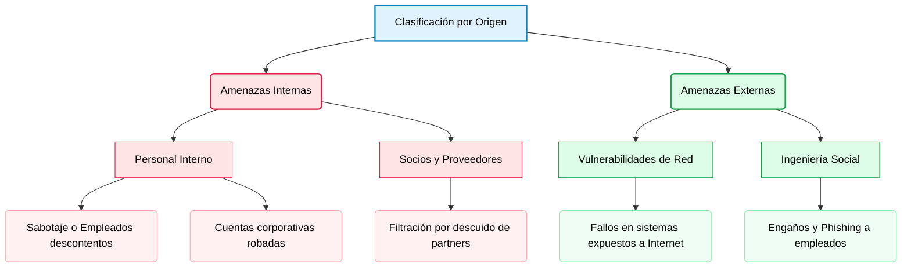

# Introducción
Introducción al curso de fundamentos de ciberseguridad.

---

<b>INDICE (Haz clic para desplegar)</b>

* [1.1 Amenazas](#11-amenazas)
* [1.1.1 Tipos](#111-tipos)
* [1.1.2 Origen de las Amenazas: Internas vs. Externas](#112-origen-de-las-amenazas-internas-vs-externas)
* [1.1.3 El Dominio de Usuario y sus Riesgos](#113-el-dominio-de-usuario-y-sus-riesgos)

---

## 1.1 Amenazas

En el panorama digital actual, las organizaciones se enfrentan a un número de ciberamenazas en constante crecimiento. Para diseñar e implementar una estrategia de defensa sólida, el primer paso fundamental es identificar las vulnerabilidades existentes dentro de los **dominios de amenazas** de la empresa.

> [!TIP]
> **Concepto clave:** Un **dominio de amenaza** es cualquier área, entorno o activo bajo el control o protección de la organización que un atacante puede explotar para comprometer un sistema y acceder a él.

Los atacantes buscan constantemente brechas en estos dominios. Las intrusiones y vectores de ataque más comunes se pueden clasificar a través de los siguientes medios:

| Vector de Ataque | Descripción y Canal de Explotación |
| :--- | :--- |
| **Acceso físico** | Entrada no autorizada a las instalaciones, salas de servidores o cableado. |
| **Redes inalámbricas** | Señales Wi-Fi que se propagan fuera del perímetro seguro del edificio. |
| **Corto alcance** | Explotación de vulnerabilidades en tecnologías como Bluetooth o NFC. |
| **Almacenamiento** | Uso de memorias USB o discos externos infectados con malware. |
| **Archivos maliciosos** | Descarga o recepción de documentos comprometidos (ej. adjuntos en correos). |
| **Aplicaciones Cloud** | Configuraciones incorrectas o fallos de seguridad en plataformas en la nube. |
| **Ingeniería social** | Uso de cuentas de redes sociales corporativas para engañar a los empleados. |

 

### 1.1.1 Tipos

Agrupar las amenazas en categorías permite a las empresas evaluar qué tan probable es sufrir un ataque y calcular el impacto económico que causaría. De esta forma, se pueden priorizar los esfuerzos y el presupuesto en las áreas más críticas.

Los peligros a los que se enfrenta una organización se clasifican en las siguientes categorías:

* **Ataques de Software:** Acciones malintencionadas que usan código para dañar los sistemas.
  * *Denegación de Servicio (DoS):* Saturar un servidor para dejarlo inoperable.
  * *Virus informáticos:* Programas ocultos que infectan archivos y dañan el equipo.
* **Errores de Software:** Fallos de programación o descuidos técnicos sin mala intención.
  * *Cierres inesperados:* Aplicaciones que se cuelgan o se desconectan solas.
  * *Vulnerabilidades web (como XSS):* Agujeros de seguridad en el código o servidores desprotegidos.
* **Sabotaje:** Ataques dirigidos a destruir la reputación o la información de la empresa.
  * *Intrusiones en bases de datos:* Acceso no autorizado para robar o alterar datos principales.
  * *Modificación web (Defacement):* Cambiar el aspecto de la web para dañar la imagen pública.
* **Error Humano:** Fallos o descuidos involuntarios de los propios empleados.
  * *Despistes en datos:* Borrar o modificar registros por equivocación.
  * *Malas configuraciones de red:* Dejar un Firewall mal configurado y abierto a internet.
* **Robo Físico:** Sustracción material de los equipos de la empresa.
  * *Pérdida de hardware:* Robo de portátiles u ordenadores en salas sin vigilancia.
* **Fallos de Hardware:** Roturas o averías en los componentes físicos de los equipos.
  * *Averías en almacenamiento:* Discos duros que fallan y provocan pérdida de datos.
* **Interrupción de Servicios:** Problemas en los suministros básicos necesarios para operar.
  * *Cortes de luz:* Apagones eléctricos que detienen los servidores de golpe.
  * *Inundaciones internas:* Activación errónea de los aspersores contra incendios.
* **Desastres Naturales:** Eventos climáticos o geológicos impredecibles que destruyen las instalaciones (terremotos, tormentas o incendios).

---

### 1.1.2 Origen de las Amenazas: Internas vs. Externas

Las amenazas a la seguridad informática también se pueden clasificar según el entorno en el que se originan. Esta distinción ayuda a entender el perímetro de defensa que se debe reforzar:

### 🏢 Amenazas Internas
Riesgos que nacen dentro de la propia organización.
* **Personal interno:** Empleados que actúan con mala intención (sabotaje) o cuyas cuentas han sido previamente comprometidas o robadas por un atacante externo.
* **Socios y proveedores (Partners):** Organizaciones externas autorizadas que, debido a una mala configuración, exponen o filtran datos confidenciales de la empresa.

### 🌐 Amenazas Externas
Peligros que provienen del exterior de la infraestructura corporativa.
* **Vulnerabilidades explotadas:** Fallos de seguridad en los equipos o servidores conectados a internet que permiten el acceso no autorizado de hackers ajenos.
* **Ingeniería social:** Técnicas de engaño y manipulación (como el Phishing) dirigidas a los empleados para conseguir que revelen credenciales o abran las puertas del sistema.

#### Diagrama de Origen de Amenazas

---

### 1.1.3 El Dominio de Usuario y sus Riesgos

El **Dominio de Usuario** abarca a cualquier persona que tenga autorización para interactuar con los sistemas de información de una organización. Esto incluye a los empleados directos, personal contratado, clientes y socios comerciales (partners).

En el ámbito de la ciberseguridad, los usuarios son considerados universalmente como **el eslabón más débil de la cadena de defensa**. Al estar expuestos a engaños o cometer errores involuntarios, representan una de las mayores amenazas para mantener a salvo la **Tríada CIA**:

* **Confidencialidad:** Riesgo de filtración de datos privados a personas no autorizadas.
* **Integridad:** Riesgo de modificación, alteración o borrado accidental de la información.
* **Disponibilidad:** Riesgo de que los sistemas queden inoperables (por ejemplo, al ejecutar un virus por descuido).

Para entender cómo se vulnera este dominio en el día a día, a continuación se detallan las principales debilidades y malas prácticas asociadas a los usuarios:

* **Falta de concienciación en seguridad:** Ocurre cuando los empleados no conocen qué datos son confidenciales ni qué normas o herramientas existen para protegerlos.
* **Políticas de seguridad mal aplicadas:** De nada sirve tener normas si los usuarios no las comprenden o ignoran las consecuencias.
