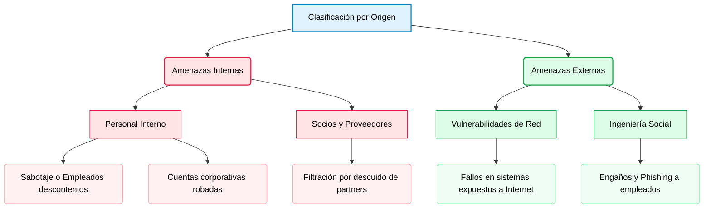

# Introducción
Introducción al curso de fundamentos de ciberseguridad.

<b>📋 Índice de contenidos (Haz clic para desplegar)</b>

1. [Amenazas](#1-amenazas)
   1.1. [Tipos](#11-tipos)
   1.2. [internas vs externas](#12-origen-de-las-amenazas-internas-vs-externas)
   1.3. [Dominio ususario](#13-el-dominio-de-usuario-y-sus-riesgos)
   1.4. [A los dominios](#14-a-los-dispositivos)
   1.5. [Redes LAN](#15-entorno-de-red-local-lan-y-sus-riesgos)
   1.6. [Nube privada](#16-amenazas-en-infraestructuras-de-nube-privada)
   1.7. [Nube pública](#17-amenazas-e-infraestructura-de-nube-pública)
   1.8. [Seguridad física](#18-amenazas-a-la-seguridad-física-y-de-las-instalaciones)
   1.9. [Dominio de aplicación](#19-amenazas-al-dominio-de-applications)
   1.10. [Ciberamenazas](#110-complejidad-y-evolución-de-las-ciberamenazas)
   1.11. [Malware avanzado](#111-malware-avanzado-puertas-traseras-backdoors-y-rootkits)
   1.12. [Inteligancia contra amenazas](#112-inteligencia-contra-amenazas-y-fuentes-de-investigación)
2. [Engaño](#2-engaño)

---

## 1. Amenazas

En el panorama digital actual, las organizaciones se enfrentan a un número de ciberamenazas en constante crecimiento. Para diseñar e implementar una estrategia de defensa sólida, el primer paso fundamental es identificar las vulnerabilidades existentes dentro de los **dominios de amenazas** de la empresa.

> [!TIP]
> **Concepto clave:** Un **dominio de amenaza** es cualquier área, entorno o activo bajo el control o protección de la organización que un atacante puede explotar para comprometer un sistema y acceder a él.

Los atacantes buscan constantemente brechas en estos dominios. Las intrusiones y vectores de ataque más comunes se pueden clasificar a través de los siguientes medios:

* **Acceso físico:** Entrada no autorizada a las instalaciones, salas de servidores o cableado.

* **Redes inalámbricas:** Señales Wi-Fi que se propagan fuera del perímetro seguro del edificio.

* **Conectividad de corto alcance:** Explotación de vulnerabilidades en tecnologías como Bluetooth o NFC.

* **Dispositivos de almacenamiento:** Uso de memorias USB o discos externos infectados con malware.

* **Archivos maliciosos:** Descarga o recepción de documentos comprometidos (ej. adjuntos en correos).

* **Aplicaciones en la nube:** Configuraciones incorrectas o fallos de seguridad en plataformas Cloud.

* **Ingeniería social en redes:** Uso de cuentas de redes sociales corporativas para engañar a los empleados.

---

### 1.1 Tipos

Agrupar las amenazas en categorías permite a las empresas evaluar qué tan probable es sufrir un ataque y calcular el impacto económico que causaría. De esta forma, se pueden priorizar los esfuerzos y el presupuesto en las áreas más críticas.

Los peligros a los que se enfrenta una organización se clasifican en las siguientes categorías:

* **Ataques de Software:** Acciones malintencionadas que usan código para dañar los sistemas.

    * **Denegación de Servicio (DoS):** Saturar un servidor para dejarlo inoperable.

    * **Virus informáticos:** Programas ocultos que infectan archivos y dañan el equipo.

* **Errores de Software:** Fallos de programación o descuidos técnicos sin mala intención.

    * **Cierres inesperados:** Aplicaciones que se cuelgan o se desconectan solas.

    * **Vulnerabilidades web (como XSS):** Agujeros de seguridad en el código o servidores de archivos desprotegidos.

* **Sabotaje:** Ataques dirigidos a destruir la reputación o la información de la empresa.

    * **Intrusiones en bases de datos:** Un atacante que logra entrar y robar o alterar los datos principales.

    * **Modificación de la web corporativa (Defacement):** Cambiar el aspecto de la página web para dañar la imagen pública.

* **Error Humano:** Fallos o descuidos involuntarios de los propios empleados.

    * **Despistes en la introducción de datos:** Borrar o modificar registros por equivocación.

    * **Malas configuraciones de red:** Dejar un Firewall mal configurado y abierto a internet por error.

* **Robo Físico:** Sustracción material de los equipos de la empresa.

    * **Pérdida de hardware corporativo:** Robar portátiles u ordenadores de salas que se quedaron abiertas o sin vigilancia.

* **Fallos de Hardware:** Roturas o averías en los componentes físicos de los equipos.

    * **Averías en el almacenamiento:** Discos duros que dejan de funcionar y provocan pérdida de datos.

* **Interrupción de Servicios:** Problemas en los suministros básicos necesarios para operar.

    * **Cortes de luz:** Apagones eléctricos que apagan los servidores de golpe.

    * **Inundaciones internas:** Daños por agua si los sistemas de aspersores contra incendios fallan y se activan por error.

* **Desastres Naturales:** Eventos climáticos o geológicos impredecibles que destruyen las instalaciones (como terremotos, tormentas o incendios).

---

### 1.2 Origen de las Amenazas: Internas vs. Externas

Las amenazas a la seguridad informática también se pueden clasificar según el entorno en el que se originan. Esta distinción ayuda a entender el perímetro de defensa que se debe reforzar:

* **Amenazas Internas:** Son aquellos riesgos que nacen dentro de la propia organización.

    * **Personal interno:** Empleados que actúan con mala intención (sabotaje) o cuyas cuentas han sido previamente comprometidas o robadas por un atacante externo.

    * **Socios y proveedores (Partners):** Organizaciones externas autorizadas que, debido a una mala configuración, exponen o filtran datos confidenciales de la empresa.
    
* **Amenazas Externas:** Son todos los peligros que provienen del exterior de la infraestructura corporativa.

    * **Vulnerabilidades explotadas:** Fallos de seguridad en los equipos o servidores conectados a internet que permiten el acceso no autorizado de hackers ajenos.

    * **Ingeniería social:** Técnicas de engaño y manipulación (como el Phishing) dirigidas a los empleados para conseguir que revelen credenciales o abran las puertas del sistema.

---

#### Diagrama de Origen de Amenazas

---

### 1.3 El Dominio de Usuario y sus Riesgos

El **Dominio de Usuario** abarca a cualquier persona que tenga autorización para interactuar con los sistemas de información de una organización. Esto incluye a los empleados directos, personal contratado, clientes y socios comerciales (partners).

En el ámbito de la ciberseguridad, los usuarios son considerados universalmente como **el eslabón más débil de la cadena de defensa**. Al estar expuestos a engaños o cometer errores involuntarios, representan una de las mayores amenazas para mantener a salvo la **Tríada CIA**:

* **Confidencialidad:** Riesgo de filtración de datos privados a personas no autorizadas.

* **Integridad:** Riesgo de modificación, alteración o borrado accidental de la información.

* **Disponibilidad:** Riesgo de que los sistemas queden inoperables (por ejemplo, al ejecutar un virus por descuido).

Para entender cómo se vulnera este dominio en el día a día, a continuación se detallan las principales debilidades y malas prácticas asociadas a los usuarios:

* **Falta de concienciación en seguridad:** Ocurre cuando los empleados no conocen qué datos son confidenciales ni qué normas o herramientas existen para protegerlos.

* **Políticas de seguridad mal aplicadas:** De nada sirve tener normas si los usuarios no las comprenden o ignoran las consecuencias de saltárselas.

* **Robo y fuga de datos:** La extracción de información confidencial por parte de un usuario genera grandes pérdidas económicas, demandas legales y daños a la reputación de la empresa.

* **Descargas no autorizadas:** Muchos ataques ocurren porque los empleados bajan archivos personales (música, juegos, vídeos) o conectan memorias USB y discos externos personales en los equipos de la oficina.

* **Uso de VPNs no autorizadas:** Usar conexiones VPN externas sin permiso oculta el tráfico de red, lo que impide a los administradores supervisar si se está robando información de la empresa.

* **Navegación por sitios web inseguros:** Visitar páginas no permitidas expone al sistema a scripts maliciosos o complementos que pueden tomar el control del dispositivo o de su cámara web.

* **Destrucción de activos digitales:** Acciones (ya sean por sabotaje o por errores graves) que provocan la eliminación de sistemas, aplicaciones o datos críticos de la compañía.

---

### 1.4 A los dispositivos

#### Riesgos Operativos y de Usuario
* **Sesiones desatendidas:** Dejar equipos activos sin supervisión facilita el acceso directo a intrusos.
* **Medios extraíbles:** Introducir memorias USB o discos no autorizados puede inyectar código dañino en el sistema.
* **Infracción de normativas:** Saltarse las políticas de seguridad de la empresa acarrea sanciones corporativas graves.

#### Amenazas de Software y Malware
* **Descargas dudosas:** Bajar archivos multimedia de fuentes sospechosas suele activar ejecutables maliciosos de fondo.
* **Explotación de fallos:** Los atacantes buscan errores de programación en aplicaciones activas para tomar el control.
* **Evolución del malware:** Los administradores deben rastrear diariamente la aparición de nuevos virus y gusanos.

#### Vulnerabilidad Tecnológica
* **Sistemas obsoletos:** Operar con hardware o software sin soporte técnico multiplica el éxito de los ciberataques.

---

### 1.5 Entorno de Red Local (LAN) y sus Riesgos

> [!NOTE]
> **Definición de LAN:** Infraestructura que interconecta dispositivos mediante medios cableados o inalámbricos dentro de un área geográfica limitada (como oficinas o edificios).

#### Seguridad y Control de Acceso
La red local actúa como el puente principal entre los usuarios y los recursos críticos del sistema. Para mitigar los riesgos en este entorno, la estrategia de defensa debe priorizar:

* **Control de acceso estricto:** Implementación de mecanismos de autenticación para regular qué dispositivos y usuarios se conectan al medio.
* **Segmentación de tráfico:** División de la red local para aislar datos sensibles y reducir la superficie de exposición ante intrusos.
* **Monitoreo local:** Inspección continua del flujo de datos interno para detectar anomalías, interceptación de tráfico (Sniffing) o propagación de malware.

---

### 1.6 Amenazas en Infraestructuras de Nube Privada

> [!NOTE]
> **Nube Privada:** Entorno de almacenamiento, servidores y recursos informáticos dedicados en exclusiva a una organización, accesibles para sus miembros a través de redes seguras o Internet.

> [!WARNING]
> Aunque suele considerarse un entorno más controlado que la nube pública, la nube privada sigue expuesta a vectores de ataque críticos que comprometen su seguridad.

#### Riesgos y Amenazas Principales:

* **Reconocimiento no autorizado:** Escaneo de puertos activos y sondeo de topología de red por parte de atacantes para buscar vías de entrada.
* **Brechas de autenticación:** Accesos ilegítimos a los recursos y datos alojados por fallos en el control de identidad.
* **Debilidades en el software base:** Presencia de vulnerabilidades sin corregir en los sistemas operativos de firewalls, routers y dispositivos de red.
* **Fallos de administración:** Errores humanos en la configuración de políticas de seguridad y reglas de enrutamiento.
* **Exfiltración por acceso remoto:** Conexiones externas de usuarios que descargan información confidencial a dispositivos desprotegidos.

---

### 1.7 Amenazas e Infraestructura de Nube Pública

> [!NOTE]
> **Nube Pública:** Servicios e infraestructuras informáticas propiedad de un proveedor externo (como AWS, Azure o GCP) que se distribuyen a través de Internet y cuyos recursos físicos se comparten de forma lógica entre múltiples organizaciones (multitenencia).

A diferencia de la nube privada, opera bajo un **modelo de responsabilidad compartida** (el proveedor protege la infraestructura global y el hardware; el cliente protege sus propios datos, accesos y configuraciones). Se divide en tres modelos:

#### Modelos de Servicio y sus Vectores de Riesgo:

* **IaaS (Infraestructura como Servicio):** El proveedor ofrece el hardware virtualizado (cómputo, redes y almacenamiento). El cliente gestiona el sistema operativo, parches y aplicaciones.
    * *Riesgo crítico:* Grupos de seguridad (firewalls) mal configurados con puertos abiertos a Internet y sistemas operativos virtuales sin actualizar.
* **PaaS (Plataforma como Servicio):** El proveedor entrega el entorno de ejecución y herramientas de desarrollo listas. El usuario solo gestiona sus aplicaciones y código.
    * *Riesgo crítico:* Inyección de código malicioso en APIs desprotegidas y robo de tokens o llaves criptográficas de los desarrolladores.
* **SaaS (Software como Servicio):** El proveedor aloja y gestiona por completo la aplicación final. El usuario accede directamente desde un navegador web.
    * *Riesgo crítico:* Secuestro de cuentas (Account Hijacking) por credenciales débiles y fugas de datos mediante ataques de Phishing dirigidos.

#### Amenazas Globales de la Nube Pública:

* **Filtración de datos (Data Breaches):** Volúmenes de almacenamiento en la nube expuestos públicamente por permisos mal configurados.
* **Gestión de identidades deficiente:** Ausencia de autenticación multifactor (MFA) en paneles de administración avanzados.
* **Ataques DoS/DDoS en la nube:** Inundación de tráfico contra las APIs públicas que puede saturar los recursos de la organización y generar costes económicos imprevistos.

---

### 1.8 Amenazas a la Seguridad Física y de las Instalaciones

> [!WARNING]
> La seguridad física de la infraestructura de TI suele pasarse por alto en los planes de ciberseguridad. Sin embargo, si un atacante logra acceso físico directo a los equipos, cualquier control de seguridad lógico o digital queda completamente anulado.

#### Vectores de Riesgo e Intrusión Física:

* **Ingreso por acompañamiento (Tailgating / Piggybacking):** Aprovechar la apertura de puertas de seguridad por personal autorizado para acceder a áreas restringidas sin identificarse.
* **Manipulación de cableado estructurado:** Acceso no autorizado a los armarios de telecomunicaciones (MDF/IDF) para interceptar físicamente el tráfico de datos de la red (Network Tapping).
* **Robo de terminales activos:** Sustracción de dispositivos portátiles, estaciones de trabajo o servidores NAS de oficinas que se han quedado desatendidas o sin controles biométricos.
* **Sabotaje del suministro de soporte:** Manipulación externa de las acometidas eléctricas, sistemas de aire acondicionado (HVAC) o sistemas de extinción de incendios para provocar caídas masivas en el centro de datos.
* **Exfiltración de residuos documentales (Dumpster Diving):** Recuperación física de información sensible (como contraseñas apuntadas, diagramas de topología o informes de red) arrojada a la basura sin destruir previamente.

---

### 1.9 Amenazas al Dominio de Aplicaciones

> [!NOTE]
> **Definición de Dominio de Aplicación:** Infraestructura que engloba todos los sistemas críticos, el software corporativo y los repositorios de datos de la organización. Actualmente, abarca tanto entornos locales (*On-Premise*) como servicios migrados a la nube pública (como plataformas de correo electrónico, herramientas de monitoreo de seguridad y sistemas de gestión de bases de datos).

#### Vectores de Riesgo Técnicos:

* **Vulnerabilidades de Desarrollo (App Web y Cliente/Servidor):**
    * *Impacto:* Fallos de lógica en el código fuente de las aplicaciones que permiten a los atacantes saltarse la autenticación o inyectar comandos maliciosos.
* **Debilidades en el Software del Sistema Operativo de Red:**
    * *Impacto:* Agujeros de seguridad y bugs sin parchear en los sistemas operativos base que dan soporte físico y lógico a las aplicaciones.
* **Pérdida y Degradación de Datos (Data Loss):**
    * *Impacto:* Destrucción, alteración o exfiltración no autorizada de la información crítica almacenada en las bases de datos.
* **Indisponibilidad por Ventanas de Mantenimiento:**
    * *Impacto:* Tiempos de inactividad de los servidores que interrumpen el flujo del negocio si los procesos de actualización fallan o se prolongan.
* **Invasión Física de la Infraestructura de Cómputo:**
    * *Impacto:* Accesos no autorizados directos a los centros de datos (CPD), salas de servidores y armarios de cableado que permiten la desconexión o manipulación del hardware que aloja las aplicaciones.

---

### 1.10 Complejidad y Evolución de las Ciberamenazas

> [!NOTE]
> **Evolución del Riesgo:** Las vulnerabilidades de software actuales se fundamentan en tres pilares: errores de programación (bugs), fallos de diseño en protocolos y configuraciones erróneas del sistema. Los ciberdelincuentes aprovechan estas brechas mediante métodos cada vez más avanzados y sofisticados.

Esta sofisticación ha dado lugar a amenazas de alta complejidad que rompen los esquemas de la seguridad tradicional:

#### 1. Amenaza Persistente Avanzada (APT - Advanced Persistent Threat)

* **Definición:** Ataque cibernético continuo y dirigido que utiliza tácticas de espionaje sumamente elaboradas, involucrando a múltiples actores coordinados y malware sofisticado.
* **Objetivo operativo:** Obtener acceso persistente a la red de un objetivo específico y analizar su infraestructura de forma continua.
* **Persistencia:** Los atacantes operan bajo el radar y permanecen sin ser detectados durante largos períodos de tiempo, generando consecuencias potencialmente devastadoras.
* **Perfil de objetivo:** Dirigido generalmente a gobiernos y organizaciones de alto nivel, debido a que las APT requieren estar muy bien organizadas y contar con un alto financiamiento económico.

#### 2. Ataques de Algoritmo (Algorithmic Attacks)

* **Definición:** Acciones malintencionadas que aprovechan los algoritmos lógicos de un software legítimo para generar comportamientos no deseados o perjudiciales en el sistema.
* **Vectores de explotación:**
    * *Perfilado y alertas falsas:* Manipulación de algoritmos de supervisión (como los que rastrean e informan el consumo de energía de una computadora) para seleccionar objetivos específicos o activar alertas falsas en los sistemas de monitoreo.
    * *Saturación de recursos:* Forzar a un ordenador a utilizar la memoria de forma masiva o a sobretrabajar su Unidad Central de Procesamiento (CPU), provocando la desactivación del equipo por sobrecarga de hardware.

---

#### 3. Flujo Logístico de un Ataque Complejo

Para que una amenaza sofisticada (como una APT) cumpla sus objetivos utilizando estos vectores, los atacantes ejecutan de forma metódica el siguiente ciclo de vida dentro de la infraestructura de red:

* **Acceso Inicial:** Entrada a la organización explotando vulnerabilidades perimetrales menores o aplicando ingeniería social sobre el Dominio de Usuario.
* **Movimiento Lateral:** Tras comprometer un primer host, los atacantes escanean la LAN para saltar de un sistema a otro, aprovechando las relaciones de confianza entre dispositivos para evadir los firewalls internos.
* **Escalada de Privilegios:** Captura de credenciales en memoria (como técnicas de extracción de hashes) para transformar una cuenta de usuario común en una con privilegios de Administrador del Sistema.
* **Establecimiento de Persistencia (C2):** Instalación de puertas traseras (*Backdoors*) y configuración de canales de Comando y Control cifrados (túneles HTTPS o DNS) para mantener el acceso y recibir órdenes externas de forma encubierta.
* **Ejecución del Objetivo Final:** Exfiltración fragmentada de datos confidenciales hacia servidores externos o despliegue masivo de Ransomware para cifrar los sistemas y forzar el pago de un rescate.

---

### 1.11 Malware Avanzado: Puertas Traseras (Backdoors) y Rootkits

> [!WARNING]
> Los ciberdelincuentes utilizan software malicioso especializado no solo para infectar un sistema, sino para romper los mecanismos de autenticación estándar, evadir las herramientas de auditoría forense y garantizar su acceso permanente a la infraestructura.

#### 1. Puertas Traseras (Backdoors) y Herramientas de Administración Remota (RAT)

* **Definición:** Programas diseñados para otorgar acceso no autorizado a un sistema informático saltándose los procedimientos de autenticación ordinarios del sistema operativo o del firewall.
* **Mecanismo de Infección:** Los atacantes suelen engañar a usuarios legítimos para que ejecuten, de forma involuntaria, un Troyano de Acceso Remoto o RAT (*Remote Access Tool / Remote Administrative Tool*).
* **Ejemplos Históricos Clave:** Herramientas de explotación como *NetBus* y *Back Orifice*.
* **Propósito Operativo:** El objetivo principal de una puerta trasera es garantizar el acceso futuro de los ciberdelincuentes a la red interna. Esto les permite reingresar al sistema de forma persistente, incluso si los administradores de TI descubren y parchean la vulnerabilidad original que se utilizó para el vector de ataque inicial.

#### 2. Rootkits

* **Definición:** Malware de alta complejidad diseñado específicamente para modificar las estructuras internas del sistema operativo (núcleo o *kernel* y archivos binarios esenciales) con el fin de ocultar su presencia y la de otras amenazas.
* **Escalada de Privilegios:** La mayoría de los rootkits se aprovechan de vulnerabilidades de desbordamiento de búfer o fallos del software base para elevar sus permisos de ejecución, obteniendo un nivel de control total sobre recursos restringidos del sistema.
* **Evasión de Detección:** Tienen la capacidad de alterar las herramientas nativas de monitoreo, los gestores de procesos y el software de análisis forense. Al falsificar las llamadas al sistema (*System Calls*), ocultan sus propios archivos y conexiones de red, haciéndose invisibles para los antivirus tradicionales.
* **Mitigación y Respuesta:** Debido a la profunda alteración que realizan sobre los archivos e instrucciones del sistema operativo, las herramientas de desinfección estándar suelen ser ineficaces. En la gran mayoría de los casos de infección confirmada, el procedimiento seguro exige formatear por completo el almacenamiento físico (borrado completo) y reinstalar el sistema operativo y el software desde cero utilizando fuentes limpias.

---

### 1.12 Inteligencia contra Amenazas y Fuentes de Investigación

> [!NOTE]
> **Inteligencia contra Amenazas (Threat Intelligence):** Conjunto de datos e información analizada sobre ataques, vulnerabilidades y vectores de explotación actuales que permite a las organizaciones anticiparse a los incidentes y reforzar sus sistemas de defensa.

Dentro del ecosistema global de ciberseguridad, existen fuentes estandarizadas de investigación, bases de datos y canales de intercambio esenciales para el análisis preventivo:

#### 1. Diccionario de Vulnerabilidades y Exposiciones Comunes (CVE - Common Vulnerabilities and Exposures)

* **Definición:** Catálogo estandarizado de registros de seguridad que identifica, define y documenta vulnerabilidades de software y hardware de conocimiento público.
* **Entidades Promotoras:** Está copatrocinado por el Equipo de Respuesta ante Emergencias Informáticas de los Estados Unidos (US-CERT) y el Departamento de Seguridad Nacional de EE. UU. (DHS).
* **Gestión y Mantenimiento:** La organización *The MITRE Corporation* se encarga de centralizar la base de datos y su sitio web público.
* **Estructura de una Entrada CVE:** Cada registro proporciona un marco estándar indexado que incluye:
    * **Identificador Estándar:** Código uniforme (ej. `CVE-AÑO-NÚMERO`) para referenciar de forma unívoca un fallo de seguridad.
    * **Descripción Técnica:** Resumen preciso del error de programación, el protocolo afectado o el impacto inicial.
    * **Referencias Cruzadas:** Enlaces a boletines de seguridad de los fabricantes, exploits públicos y parches de mitigación.

#### 2. Monitorización de la Red Oscura (Dark Web)

* **Definición:** Espacio de Internet compuesto por contenido web cifrado que no está indexado por los motores de búsqueda convencionales, lo que requiere software específico (como Tor), autorizaciones o configuraciones dedicadas para acceder.
* **Aplicación en Ciberseguridad:** Los investigadores expertos en amenazas rastrean e inspeccionan de forma constante estos entornos y foros clandestinos.
* **Objetivo Operativo:** Detectar de forma proactiva la venta de credenciales corporativas filtradas, código de exploits de día cero (*Zero-Day*) y la planificación de campañas de ataques dirigidos.

#### 3. Indicadores de Compromiso o Riesgo (IoC - Indicators of Compromise)

* **Definición:** Datos técnicos forenses que sirven como evidencia observable de que un sistema o una red ha sufrido una violación de seguridad o una intrusión activa.
* **Componentes y Elementos:** Proporcionan detalles precisos del ataque a través de:
    * **Firmas de Malware:** Valores Hash (MD5, SHA-256) de archivos ejecutables maliciosos detectados.
    * **Artefactos de Red:** Nombres de dominio sospechosos, direcciones IP de servidores de Comando y Control (C2) o patrones inusuales de tráfico de datos.
    * **Alteraciones del Sistema:** Rutas de registro modificadas en el sistema operativo o archivos de configuración locales sospechosos.

#### 4. Uso Compartido de Indicadores Automatizados (AIS - Automated Indicator Sharing)

* **Definición:** Capacidad técnica desarrollada por la Agencia de Seguridad de Infraestructura y Ciberseguridad (CISA) de los Estados Unidos que permite el intercambio masivo y en tiempo real de indicadores de ciberamenazas entre el gobierno y el sector privado.
* **Estándares y Protocolos Técnicos:** Para automatizar este intercambio de datos sin intervención humana, AIS se apoya en dos tecnologías clave:
    * **STIX (Structured Threat Information Expression):** Un lenguaje estandarizado, estructurado y basado en XML/JSON para modelar, caracterizar y describir la información técnica de las amenazas informáticas de manera uniforme.
    * **TAXII (Trusted Automated Exchange of Intelligence Information):** El protocolo de capa de aplicación que define los servicios y mensajes necesarios para transportar de forma segura la inteligencia de amenazas (los archivos STIX) a través de redes IP.

---

## 2. Engaño

## 2.1 Ingeniería social

La ingeniería social es un método de ataque que busca manipular a las personas para que realicen acciones involuntarias o divulguen información confidencial. A diferencia de los ciberataques convencionales, este enfoque no explota vulnerabilidades en el software o el hardware, sino las debilidades de la psicología humana.

### Mecanismos de Manipulación

Los atacantes diseñan sus vectores de ataque aprovechando rasgos intrínsecos del comportamiento humano:

* **Disposición a ayudar:** Explotación de la empatía o la cortesía del usuario.
* **Avaricia o vanidad:** Promesas de beneficios económicos o reconocimiento.
* **Urgencia o miedo:** Creación de escenarios de falsas crisis que exigen una respuesta inmediata.

---

### Tipos Comunes de Ataques

A continuación se analizan las variantes más extendidas de este tipo de amenazas:

#### Fraude de Identidad (Identity Theft)

Consiste en la obtención y el uso no autorizado de los datos personales de un individuo para suplantar su identidad. El objetivo suele ser adquirir bienes, servicios o beneficios financieros mediante el engaño.

> [!NOTE]
> **Escenario Típico:** Un atacante recopila información personal de la víctima (nombres, documentos de identidad, fechas de nacimiento). Posteriormente, utiliza estos registros para tramitar productos financieros o créditos bancarios a nombre del afectado.

#### Quid pro quo

Consiste en la solicitud de datos a cambio de un beneficio. Por ejemplo, esto se usa mucho en ataques de *phishing*, donde se piden datos personales a cambio de unas vacaciones gratuitas.

> [!NOTE]
> **Escenario Típico:** Un atacante envía un correo de phishing a un empleado indicando que si facilita sus credenciales obtendrá unas vacaciones gratis.

#### Pretexto (Pretexting)

Consiste en la creación de un escenario falso o una historia creíble (el pretexto) para engañar a una víctima. El atacante suele suplantar una identidad de autoridad o confianza para manipular a la persona y lograr que revele información confidencial o datos privilegiados.

> [!NOTE]
> **Escenario Típico:** Un atacante llama a un empleado haciéndose pasar por un técnico de soporte de TI. Afirma que hay un fallo en el sistema y le pide sus credenciales de acceso para "confirmar su identidad" y solucionar el problema.

---

### 2.1.1 Tácticas de ingeniería social

Algunas de las tácticas de ingeniería social son:

1. **Autoridad:** Aprovechan la autoridad de algún jefe o empleado con rango alto para solicitar información a sus subordinados, quienes obedecen por respeto o temor a represalias.
2. **Urgencia:** Crean una falsa sensación de prisa o escasez de tiempo para que la víctima actúe rápido y tome decisiones impulsivas sin verificar la fuente.
3. **Intimidación:** Utilizan amenazas o un tono agresivo (como consecuencias legales o despido) para asustar a la víctima y obligarla a colaborar.
4. **Consenso o prueba social:** Engañan a la víctima haciéndole creer que sus compañeros o personas de confianza ya han realizado la acción solicitada.
5. **Escasez:** Ofrecen un beneficio o advierten de la pérdida de un servicio por tiempo muy limitado, apelando al miedo a quedarse fuera (FOMO).
6. **Familiaridad o simpatía:** El atacante busca agradar a la víctima, entablar una conversación amigable o encontrar intereses comunes para ganarse su confianza antes del fraude.
7. **Confianza:** Se aprovechan de la buena voluntad inherente de las personas y de su deseo natural de ayudar a los demás ante un problema.

---

### 2.1.2 Métodos y Ataques de Engaño Digital

Estos ataques representan los métodos y escenarios lógicos donde se aplican las tácticas de manipulación psicológica descritas anteriormente:

*   **Simulación de Identidad (Impersonation):** El atacante suplanta a una figura de autoridad (como un inspector fiscal o soporte de TI) para coaccionar a la víctima mediante amenazas, o suplanta a la propia víctima en redes sociales para destruir su credibilidad.
*   **Hoaxes (Bulos o Engaños Masivos):** Falsas alarmas diseñadas para provocar pánico colectivo. Un ejemplo típico son las alertas de virus inexistentes que exigen al usuario reenviar el mensaje a todos sus contactos, explotando la táctica de confianza y miedo.
*   **Estafa de Facturas (Invoice Scam):** Envío de cobros fraudulentos que emplean lenguaje urgente o amenazante para obligar a un empleado a realizar pagos involuntarios o a introducir credenciales financieras en portales falsos.
*   **Ataque de Abrevadero (Watering Hole):** El atacante identifica y compromete con malware los sitios web legítimos que los miembros de una organización visitan con frecuencia, esperando pacientemente a que las víctimas se infecten de forma pasiva.
*   **Typosquatting (Secuestro de URL):** Registro de nombres de dominio maliciosos que imitan errores tipográficos comunes al escribir URLs populares (ej. *gogle.com*). Busca redirigir al usuario a sitios fraudulentos para capturar datos o inyectar código malicioso.
*   **Bypass de Etiquetas de Correo (Remitente Externo):** Manipulación técnica de los encabezados de un correo para eliminar la advertencia de "Remitente Externo" implementada por la empresa, engañando al empleado para que crea que el mensaje se originó de forma interna y legítima.
*   **Campañas de Influencia (Influence Campaigns):** Uso estratégico y coordinado de noticias falsas, desinformación y perfiles automatizados (bots) en redes sociales para alterar la opinión pública, generar desestabilización o dirigir el comportamiento de un colectivo.

---

### 2.1.3 Ataques Físicos de Ingeniería Social

A diferencia de las amenazas digitales, estas técnicas se basan en la observación directa, la recolección de elementos materiales o el acceso no autorizado al entorno físico de la víctima.

#### Shoulder Surfing (Mirar por encima del hombro)
Consiste en observar físicamente a una persona mientras introduce información confidencial en un dispositivo. El atacante puede mirar de forma directa o utilizar herramientas de asistencia como binoculares, lentes telescópicas o cámaras de seguridad comprometidas.

*   **Objetivo común:** Capturar contraseñas de desbloqueo, códigos PIN de tarjetas bancarias, credenciales de acceso o patrones de seguridad.
> [!NOTE]
> **Escenario Típico:** Un atacante hace fila detrás de un empleado en una cafetería y mira disimuladamente la pantalla de su teléfono mientras este escribe la contraseña de acceso a la red corporativa.

#### Dumpster Diving (Búsqueda en la basura)
Consiste en revisar los contenedores de basura, reciclaje o desechos de una organización o individuo con el fin de encontrar documentos impresos o soportes físicos que contengan datos valiosos.

*   **Objetivo común:** Obtener manuales técnicos, listas de empleados, facturas con datos fiscales, organigramas o datos de clientes que sirvan para planificar un ataque posterior más complejo.
> [!NOTE]
> **Escenario Típico:** Un atacante registra el contenedor de reciclaje de papel de una empresa y encuentra un listado impreso desactualizado que contiene los correos electrónicos y extensiones telefónicas de todo el departamento de finanzas.

#### Tailgating (Seguimiento cercano)
Consiste en seguir muy de cerca a una persona autorizada que acaba de abrir una puerta blindada o un punto de acceso restringido, logrando colarse justo antes de que el mecanismo de seguridad cierre el paso por completo. En este caso, **la persona legítima no es consciente** de que está facilitando el acceso al intruso.

*   **Objetivo común:** Superar barreras perimetrales físicas, torniquetes o controles biométricos sin levantar sospechas ni activar alarmas.
>[!NOTE]
>[Escenario Típico]
>Un empleado pasa su tarjeta magnética para entrar al centro de datos y el atacante camina rápidamente detrás de él, aprovechando la inercia de la puerta para colarse antes de que el muelle hidráulico cierre el acceso.

#### Piggybacking (Acceso consentido por cortesía)
A diferencia del tailgating, en esta técnica **la persona autorizada sí sabe** que está dejando pasar al atacante a la zona restringida. El intruso logra este acceso manipulando las normas sociales de cortesía, educación o compañerismo para que el empleado colabore voluntariamente sin verificar sus credenciales.

*   **Objetivo común:** Saltarse los protocolos de seguridad física y de identificación de una empresa aprovechándose de la empatía o el deseo natural de ayudar del ser humano.
>[!NOTE]
>[Escenario Típico]
>El atacante se acerca a la entrada restringida cargando varias cajas pesadas y le dice a un empleado: "¡Hola! ¿Me sostienes la puerta, por favor? Voy muy cargado". El empleado, por pura educación, mantiene la puerta abierta y le permite el paso sin pedirle su acreditación.

---

### 2.1.4 Estrategias de Mitigación y Cultura de Seguridad Colectiva

Las organizaciones deben fortalecer su factor humano mediante la concienciación continua sobre las tácticas de manipulación psicológica. Para prevenir incidentes de ingeniería social, se deben implementar y promover las siguientes pautas operativas entre todos los miembros del equipo:

*   **Principio de Privilegio Mínimo e Identificación:** Prohibir de forma estricta la entrega de credenciales de acceso, contraseñas o datos corporativos confidenciales a través de canales no verificados (como llamadas telefónicas entrantes, chats o correos electrónicos), sin importar la supuesta urgencia del solicitante.
*   **Gestión de Enlaces y Conectividad:** Evitar interactuar con hipervínculos, botones o archivos adjuntos que lleguen en comunicaciones electrónicas sospechosas, llamativas o que apelen a la curiosidad del usuario.
*   **Control de Descargas:** Supervisar y bloquear cualquier tipo de descarga de software o archivos automatizados que no hayan sido iniciados de forma consciente por el propio usuario en sitios web oficiales.
*   **Políticas de Seguridad Institucionales:** Definir marcos normativos internos claros y capacitar periódicamente al personal para que conozca los canales oficiales de reporte ante un posible fraude.
*   **Responsabilidad Compartida:** Fomentar una cultura corporativa donde cada empleado entienda que la seguridad de la información es un compromiso colectivo y que reportar anomalías a tiempo protege a toda la organización.

> [!IMPORTANT]
> **Gestión de la Presión Psicológica:** Los ataques exitosos suelen explotar la prisa o la intimidación. Ante cualquier solicitud inusual que genere urgencia o coacción por parte de un tercero, el empleado debe detener la comunicación de inmediato y verificar la identidad del emisor a través de un canal secundario oficial.
