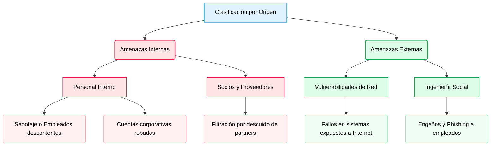
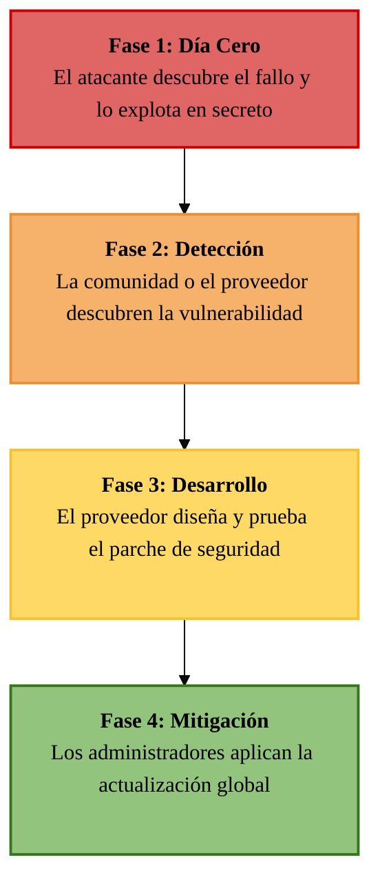
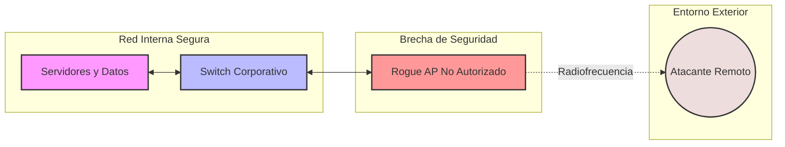
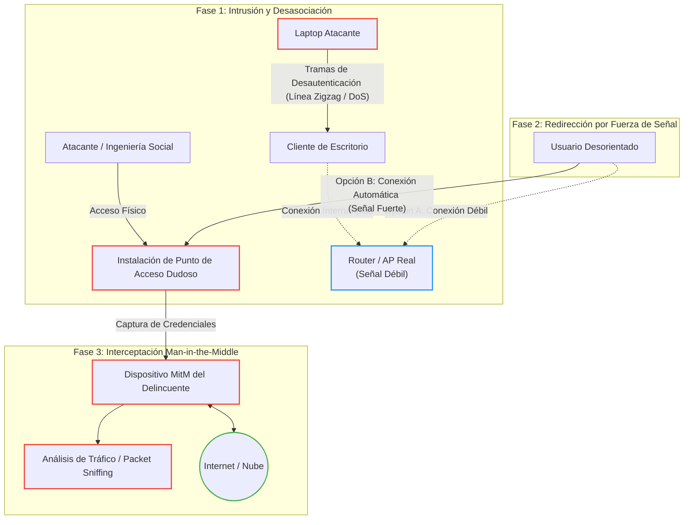
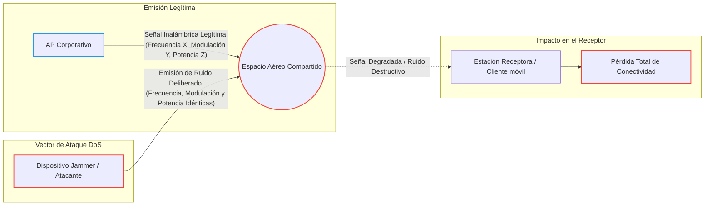
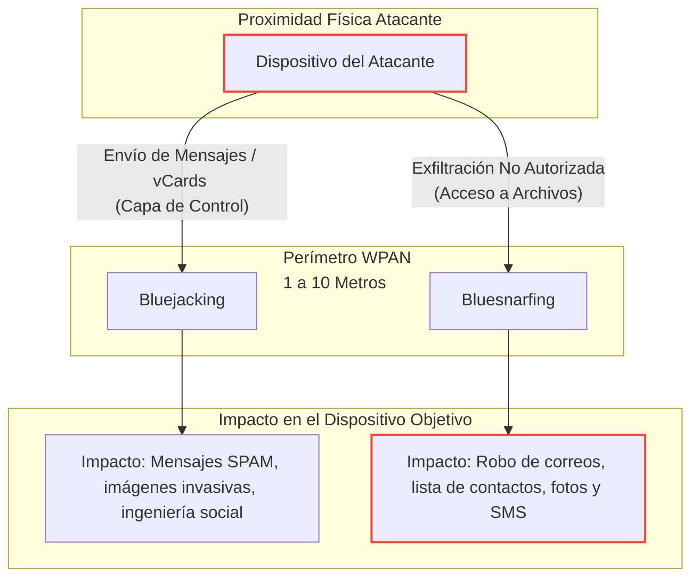
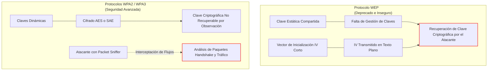
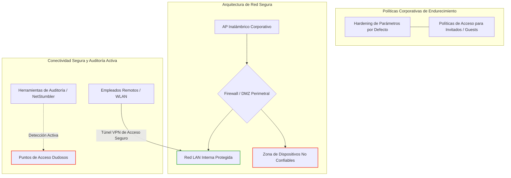

# Introducción
Introducción al curso de fundamentos de ciberseguridad.

<details>
<summary>🗺️ Navegación de los Apuntes (GitHub Pages)</summary>

* ⬅️ [Volver al Índice Anterior](./README.md)

</details>

<details>
<summary><b>📋 Índice de contenidos (Haz clic para desplegar)</b></summary>

1. [Amenazas](#1-amenazas)
   - [1.1. Tipos](#11-tipos)
   - [1.2. Origen de las Amenazas: Internas vs. Externas](#12-origen-de-las-amenazas-internas-vs-externas)
   - [1.3. El Dominio de Usuario y sus Riesgos](#13-el-dominio-de-usuario-y-sus-riesgos)
   - [1.4. A los dispositivos](#14-a-los-dispositivos)
   - [1.5. Entorno de Red Local (LAN) y sus Riesgos](#15-entorno-de-red-local-lan-y-sus-riesgos)
   - [1.6. Amenazas en Infraestructuras de Nube Privada](#16-amenazas-en-infraestructuras-de-nube-privada)
   - [1.7. Amenazas e Infraestructura de Nube Pública](#17-amenazas-e-infraestructura-de-nube-pública)
   - [1.8. Amenazas a la Seguridad Física y de las Instalaciones](#18-amenazas-a-la-seguridad-física-y-de-las-instalaciones)
   - [1.9. Amenazas al Dominio de Aplicaciones](#19-amenazas-al-dominio-de-aplicaciones)
   - [1.10. Complejidad y Evolución de las Ciberamenazas](#110-complejidad-y-evolución-de-las-ciberamenazas)
   - [1.11. Malware Avanzado: Puertas Traseras (Backdoors) y Rootkits](#111-malware-avanzado-puertas-traseras-backdoors-y-rootkits)
   - [1.12. Inteligencia contra Amenazas y Fuentes de Investigación](#112-inteligencia-contra-amenazas-y-fuentes-de-investigación)

2. [Engaño](#2-engaño)
   - [2.1. Ingeniería social](#21-ingeniería-social)
     - [2.1.1. Tácticas de ingeniería social](#211-tácticas-de-ingeniería-social)
     - [2.1.2. Métodos y Ataques de Engaño Digital](#212-métodos-y-ataques-de-engaño-digital)
     - [2.1.3. Ataques Físicos de Ingeniería Social](#213-ataques-físicos-de-ingeniería-social)
     - [2.1.4. Estrategias de Mitigación y Cultura de Seguridad Colectiva](#214-estrategias-de-mitigación-y-cultura-de-seguridad-colectiva)

3. [Ciberataques](#3-ciberataques)
    - [3.1 Malware](#31-introducción-al-software-malicioso-malware)
    - [3.2 Bombas Lógicas](#32-bombas-lógicas)
    - [3.3 Ransomware](#33-ransomware)
    - [3.4 Ataques por Denegación de Servicio (DoS)](#34-ataques-por-denegación-de-servicio-dos)
    - [3.5 Ataques por Denegación de Servicio Distribuida (DDoS)](#35-ataques-por-denegación-de-servicio-distribuida-ddos)
    - [3.6 Ataques al Sistema de Nombres de Dominio (DNS) y Servicios de Red](#36-ataques-al-sistema-de-nombres-de-dominio-dns-y-servicios-de-red)
    - [3.7 Ataques de Capa 2 (Enlace de Datos)](#37-ataques-de-capa-2-enlace-de-datos)
    - [3.8 Ataques en Ruta: Man-in-the-Middle (MitM) y Man-in-the-Mobile (MitMo)](#38-ataques-en-ruta-man-in-the-middle-mitm-y-man-in-the-mobile-mitmo)
    - [3.9 Ataques de Día Cero (Zero-Day Attacks)](#39-ataques-de-día-cero-zero-day-attacks)
    - [3.10 Registro de Teclado (Keylogging)](#310-registro-de-teclado-keylogging)
    - [3.11 Recomendaciones Técnicas de Defensa contra Ataques](#311-recomendaciones-técnicas-de-defensa-contra-ataques)


4. [Ciberataques Móviles e Inalámbricos](#4-seguridad-en-redes-inalámbricas-y-vectores-de-ataque-móviles)
    - [4.1 Introducción y Superficie de Ataque Inalámbrica](#41-introducción-y-superficie-de-ataque-inalámbrica)
    - [4.2 Amenazas Específicas: Grayware y SMiShing](#42-amenazas-específicas-grayware-y-smishing)
    - [4.3 Puntos de Acceso No Autorizados (Rogue Access Points)](#43-puntos-de-acceso-no-autorizados-rogue-access-points)
    - [4.4 Vectores de Ataque Inalámbricos Avanzados](#44-vectores-de-ataque-inalámbricos-avanzados)
    - [4.5 Bloqueo de Radiofrecuencia (RF Jamming) y Denegación de Servicio Física](#45-bloqueo-de-radiofrecuencia-rf-jamming-y-denegación-de-servicio-física)
    - [4.6 Ataques a Redes de Área Personal: Bluejacking y Bluesnarfing](#46-ataques-a-redes-de-área-personal-bluejacking-y-bluesnarfing)
    - [4.7 Evolución y Vulnerabilidades en Protocolos de Seguridad Wi-Fi (WEP vs. WPA2/WPA3)](#47-evolución-y-vulnerabilidades-en-protocolos-de-seguridad-wi-fi-wep-vs-wpa2wpa3)
    - [4.8 Mecanismos de Defensa y Endurecimiento (Hardening) Inalámbrico y Móvil](#48-mecanismos-de-defensa-y-endurecimiento-hardening-inalámbrico-y-móvil)

5. [Seguridad en la web](#5-seguridad-de-las-webs)

</details>


---


## 1. Amenazas


En el panorama digital actual, las organizaciones se enfrentan a un número de ciberamenazas en constante crecimiento. Para diseñar e implementar una estrategia de defensa sólida, el primer paso fundamental es identificar las vulnerabilidades existentes dentro de los **dominios de amenazas** de la empresa.

> [!TIP]
> **Concepto clave:** Un **dominio de amenaza** es cualquier área, entorno o activo bajo el control o protección de la organización que un atacante puede explotar para comprometer un sistema y acceder a él.

Los atacantes buscan constantemente brechas en estos dominios. Las intrusiones y vectores de ataque más comunes se pueden clasificar a través de los siguientes medios:

* **Acceso físico:** Entrada no autorizada a las instalaciones, salas de servidores o cableado.

* **Redes inalámbricas:** Señales Wi-Fi que se propagan fuera del perímetro seguro del edificio.

* **Conectividad de corto alcance:** Explotación de vulnerabilidades en tecnologías como Bluetooth o NFC.

* **Dispositivos de almacenamiento:** Uso de memorias USB o discos externos infectados con malware.

* **Archivos maliciosos:** Descarga o recepción de documentos comprometidos (ej. adjuntos en correos).

* **Aplicaciones en la nube:** Configuraciones incorrectas o fallos de seguridad en plataformas Cloud.

* **Ingeniería social en redes:** Uso de cuentas de redes sociales corporativas para engañar a los empleados.

---

### 1.1 Tipos

Agrupar las amenazas en categorías permite a las empresas evaluar qué tan probable es sufrir un ataque y calcular el impacto económico que causaría. De esta forma, se pueden priorizar los esfuerzos y el presupuesto en las áreas más críticas.

Los peligros a los que se enfrenta una organización se clasifican en las siguientes categorías:

* **Ataques de Software:** Acciones malintencionadas que usan código para dañar los sistemas.

    * **Denegación de Servicio (DoS):** Saturar un servidor para dejarlo inoperable.

    * **Virus informáticos:** Programas ocultos que infectan archivos y dañan el equipo.

* **Errores de Software:** Fallos de programación o descuidos técnicos sin mala intención.

    * **Cierres inesperados:** Aplicaciones que se cuelgan o se desconectan solas.

    * **Vulnerabilidades web (como XSS):** Agujeros de seguridad en el código o servidores de archivos desprotegidos.

* **Sabotaje:** Ataques dirigidos a destruir la reputación o la información de la empresa.

    * **Intrusiones en bases de datos:** Un atacante que logra entrar y robar o alterar los datos principales.

    * **Modificación de la web corporativa (Defacement):** Cambiar el aspecto de la página web para dañar la imagen pública.

* **Error Humano:** Fallos o descuidos involuntarios de los propios empleados.

    * **Despistes en la introducción de datos:** Borrar o modificar registros por equivocación.

    * **Malas configuraciones de red:** Dejar un Firewall mal configurado y abierto a internet por error.

* **Robo Físico:** Sustracción material de los equipos de la empresa.

    * **Pérdida de hardware corporativo:** Robar portátiles u ordenadores de salas que se quedaron abiertas o sin vigilancia.

* **Fallos de Hardware:** Roturas o averías en los componentes físicos de los equipos.

    * **Averías en el almacenamiento:** Discos duros que dejan de funcionar y provocan pérdida de datos.

* **Interrupción de Servicios:** Problemas en los suministros básicos necesarios para operar.

    * **Cortes de luz:** Apagones eléctricos que apagan los servidores de golpe.

    * **Inundaciones internas:** Daños por agua si los sistemas de aspersores contra incendios fallan y se activan por error.

* **Desastres Naturales:** Eventos climáticos o geológicos impredecibles que destruyen las instalaciones (como terremotos, tormentas o incendios).

---

### 1.2 Origen de las Amenazas: Internas vs. Externas

Las amenazas a la seguridad informática también se pueden clasificar según el entorno en el que se originan. Esta distinción ayuda a entender el perímetro de defensa que se debe reforzar:

* **Amenazas Internas:** Son aquellos riesgos que nacen dentro de la propia organización.

    * **Personal interno:** Empleados que actúan con mala intención (sabotaje) o cuyas cuentas han sido previamente comprometidas o robadas por un atacante externo.

    * **Socios y proveedores (Partners):** Organizaciones externas autorizadas que, debido a una mala configuración, exponen o filtran datos confidenciales de la empresa.
    
* **Amenazas Externas:** Son todos los peligros que provienen del exterior de la infraestructura corporativa.

    * **Vulnerabilidades explotadas:** Fallos de seguridad en los equipos o servidores conectados a internet que permiten el acceso no autorizado de hackers ajenos.

    * **Ingeniería social:** Técnicas de engaño y manipulación (como el Phishing) dirigidas a los empleados para conseguir que revelen credenciales o abran las puertas del sistema.

---

#### Diagrama de Origen de Amenazas


---

### 1.3 El Dominio de Usuario y sus Riesgos

El **Dominio de Usuario** abarca a cualquier persona que tenga autorización para interactuar con los sistemas de información de una organización. Esto incluye a los empleados directos, personal contratado, clientes y socios comerciales (partners).

En el ámbito de la ciberseguridad, los usuarios son considerados universalmente como **el eslabón más débil de la cadena de defensa**. Al estar expuestos a engaños o cometer errores involuntarios, representan una de las mayores amenazas para mantener a salvo la **Tríada CIA**:

* **Confidencialidad:** Riesgo de filtración de datos privados a personas no autorizadas.

* **Integridad:** Riesgo de modificación, alteración o borrado accidental de la información.

* **Disponibilidad:** Riesgo de que los sistemas queden inoperables (por ejemplo, al ejecutar un virus por descuido).

Para entender cómo se vulnera este dominio en el día a día, a continuación se detallan las principales debilidades y malas prácticas asociadas a los usuarios:

* **Falta de concienciación en seguridad:** Ocurre cuando los empleados no conocen qué datos son confidenciales ni qué normas o herramientas existen para protegerlos.

* **Políticas de seguridad mal aplicadas:** De nada sirve tener normas si los usuarios no las comprenden o ignoran las consecuencias de saltárselas.

* **Robo y fuga de datos:** La extracción de información confidencial por parte de un usuario genera grandes pérdidas económicas, demandas legales y daños a la reputación de la empresa.

* **Descargas no autorizadas:** Muchos ataques ocurren porque los empleados bajan archivos personales (música, juegos, vídeos) o conectan memorias USB y discos externos personales en los equipos de la oficina.

* **Uso de VPNs no autorizadas:** Usar conexiones VPN externas sin permiso oculta el tráfico de red, lo que impide a los administradores supervisar si se está robando información de la empresa.

* **Navegación por sitios web inseguros:** Visitar páginas no permitidas expone al sistema a scripts maliciosos o complementos que pueden tomar el control del dispositivo o de su cámara web.

* **Destrucción de activos digitales:** Acciones (ya sean por sabotaje o por errores graves) que provocan la eliminación de sistemas, aplicaciones o datos críticos de la compañía.

---

### 1.4 A los dispositivos

#### Riesgos Operativos y de Usuario
* **Sesiones desatendidas:** Dejar equipos activos sin supervisión facilita el acceso directo a intrusos.
* **Medios extraíbles:** Introducir memorias USB o discos no autorizados puede inyectar código dañino en el sistema.
* **Infracción de normativas:** Saltarse las políticas de seguridad de la empresa acarrea sanciones corporativas graves.

#### Amenazas de Software y Malware
* **Descargas dudosas:** Bajar archivos multimedia de fuentes sospechosas suele activar ejecutables maliciosos de fondo.
* **Explotación de fallos:** Los atacantes buscan errores de programación en aplicaciones activas para tomar el control.
* **Evolución del malware:** Los administradores deben rastrear diariamente la aparición de nuevos virus y gusanos.

#### Vulnerabilidad Tecnológica
* **Sistemas obsoletos:** Operar con hardware o software sin soporte técnico multiplica el éxito de los ciberataques.

---

### 1.5 Entorno de Red Local (LAN) y sus Riesgos

> [!NOTE]
> **Definición de LAN:** Infraestructura que interconecta dispositivos mediante medios cableados o inalámbricos dentro de un área geográfica limitada (como oficinas o edificios).

#### Seguridad y Control de Acceso
La red local actúa como el puente principal entre los usuarios y los recursos críticos del sistema. Para mitigar los riesgos en este entorno, la estrategia de defensa debe priorizar:

* **Control de acceso estricto:** Implementación de mecanismos de autenticación para regular qué dispositivos y usuarios se conectan al medio.
* **Segmentación de tráfico:** División de la red local para aislar datos sensibles y reducir la superficie de exposición ante intrusos.
* **Monitoreo local:** Inspección continua del flujo de datos interno para detectar anomalías, interceptación de tráfico (Sniffing) o propagación de malware.

---

### 1.6 Amenazas en Infraestructuras de Nube Privada

> [!NOTE]
> **Nube Privada:** Entorno de almacenamiento, servidores y recursos informáticos dedicados en exclusiva a una organización, accesibles para sus miembros a través de redes seguras o Internet.

> [!WARNING]
> Aunque suele considerarse un entorno más controlado que la nube pública, la nube privada sigue expuesta a vectores de ataque críticos que comprometen su seguridad.

#### Riesgos y Amenazas Principales:

* **Reconocimiento no autorizado:** Escaneo de puertos activos y sondeo de topología de red por parte de atacantes para buscar vías de entrada.
* **Brechas de autenticación:** Accesos ilegítimos a los recursos y datos alojados por fallos en el control de identidad.
* **Debilidades en el software base:** Presencia de vulnerabilidades sin corregir en los sistemas operativos de firewalls, routers y dispositivos de red.
* **Fallos de administración:** Errores humanos en la configuración de políticas de seguridad y reglas de enrutamiento.
* **Exfiltración por acceso remoto:** Conexiones externas de usuarios que descargan información confidencial a dispositivos desprotegidos.

---

### 1.7 Amenazas e Infraestructura de Nube Pública

> [!NOTE]
> **Nube Pública:** Servicios e infraestructuras informáticas propiedad de un proveedor externo (como AWS, Azure o GCP) que se distribuyen a través de Internet y cuyos recursos físicos se comparten de forma lógica entre múltiples organizaciones (multitenencia).

A diferencia de la nube privada, opera bajo un **modelo de responsabilidad compartida** (el proveedor protege la infraestructura global y el hardware; el cliente protege sus propios datos, accesos y configuraciones). Se divide en tres modelos:

#### Modelos de Servicio y sus Vectores de Riesgo:

* **IaaS (Infraestructura como Servicio):** El proveedor ofrece el hardware virtualizado (cómputo, redes y almacenamiento). El cliente gestiona el sistema operativo, parches y aplicaciones.
    * *Riesgo crítico:* Grupos de seguridad (firewalls) mal configurados con puertos abiertos a Internet y sistemas operativos virtuales sin actualizar.
* **PaaS (Plataforma como Servicio):** El proveedor entrega el entorno de ejecución y herramientas de desarrollo listas. El usuario solo gestiona sus aplicaciones y código.
    * *Riesgo crítico:* Inyección de código malicioso en APIs desprotegidas y robo de tokens o llaves criptográficas de los desarrolladores.
* **SaaS (Software como Servicio):** El proveedor aloja y gestiona por completo la aplicación final. El usuario accede directamente desde un navegador web.
    * *Riesgo crítico:* Secuestro de cuentas (Account Hijacking) por credenciales débiles y fugas de datos mediante ataques de Phishing dirigidos.

#### Amenazas Globales de la Nube Pública:

* **Filtración de datos (Data Breaches):** Volúmenes de almacenamiento en la nube expuestos públicamente por permisos mal configurados.
* **Gestión de identidades deficiente:** Ausencia de autenticación multifactor (MFA) en paneles de administración avanzados.
* **Ataques DoS/DDoS en la nube:** Inundación de tráfico contra las APIs públicas que puede saturar los recursos de la organización y generar costes económicos imprevistos.

---

### 1.8 Amenazas a la Seguridad Física y de las Instalaciones

> [!WARNING]
> La seguridad física de la infraestructura de TI suele pasarse por alto en los planes de ciberseguridad. Sin embargo, si un atacante logra acceso físico directo a los equipos, cualquier control de seguridad lógico o digital queda completamente anulado.

#### Vectores de Riesgo e Intrusión Física:

* **Ingreso por acompañamiento (Tailgating / Piggybacking):** Aprovechar la apertura de puertas de seguridad por personal autorizado para acceder a áreas restringidas sin identificarse.
* **Manipulación de cableado estructurado:** Acceso no autorizado a los armarios de telecomunicaciones (MDF/IDF) para interceptar físicamente el tráfico de datos de la red (Network Tapping).
* **Robo de terminales activos:** Sustracción de dispositivos portátiles, estaciones de trabajo o servidores NAS de oficinas que se han quedado desatendidas o sin controles biométricos.
* **Sabotaje del suministro de soporte:** Manipulación externa de las acometidas eléctricas, sistemas de aire acondicionado (HVAC) o sistemas de extinción de incendios para provocar caídas masivas en el centro de datos.
* **Exfiltración de residuos documentales (Dumpster Diving):** Recuperación física de información sensible (como contraseñas apuntadas, diagramas de topología o informes de red) arrojada a la basura sin destruir previamente.

---

### 1.9 Amenazas al Dominio de Aplicaciones

> [!NOTE]
> **Definición de Dominio de Aplicación:** Infraestructura que engloba todos los sistemas críticos, el software corporativo y los repositorios de datos de la organización. Actualmente, abarca tanto entornos locales (*On-Premise*) como servicios migrados a la nube pública (como plataformas de correo electrónico, herramientas de monitoreo de seguridad y sistemas de gestión de bases de datos).

#### Vectores de Riesgo Técnicos:

* **Vulnerabilidades de Desarrollo (App Web y Cliente/Servidor):**
    * *Impacto:* Fallos de lógica en el código fuente de las aplicaciones que permiten a los atacantes saltarse la autenticación o inyectar comandos maliciosos.
* **Debilidades en el Software del Sistema Operativo de Red:**
    * *Impacto:* Agujeros de seguridad y bugs sin parchear en los sistemas operativos base que dan soporte físico y lógico a las aplicaciones.
* **Pérdida y Degradación de Datos (Data Loss):**
    * *Impacto:* Destrucción, alteración o exfiltración no autorizada de la información crítica almacenada en las bases de datos.
* **Indisponibilidad por Ventanas de Mantenimiento:**
    * *Impacto:* Tiempos de inactividad de los servidores que interrumpen el flujo del negocio si los procesos de actualización fallan o se prolongan.
* **Invasión Física de la Infraestructura de Cómputo:**
    * *Impacto:* Accesos no autorizados directos a los centros de datos (CPD), salas de servidores y armarios de cableado que permiten la desconexión o manipulación del hardware que aloja las aplicaciones.

---

### 1.10 Complejidad y Evolución de las Ciberamenazas

> [!NOTE]
> **Evolución del Riesgo:** Las vulnerabilidades de software actuales se fundamentan en tres pilares: errores de programación (bugs), fallos de diseño en protocolos y configuraciones erróneas del sistema. Los ciberdelincuentes aprovechan estas brechas mediante métodos cada vez más avanzados y sofisticados.

Esta sofisticación ha dado lugar a amenazas de alta complejidad que rompen los esquemas de la seguridad tradicional:

#### 1. Amenaza Persistente Avanzada (APT - Advanced Persistent Threat)

* **Definición:** Ataque cibernético continuo y dirigido que utiliza tácticas de espionaje sumamente elaboradas, involucrando a múltiples actores coordinados y malware sofisticado.
* **Objetivo operativo:** Obtener acceso persistente a la red de un objetivo específico y analizar su infraestructura de forma continua.
* **Persistencia:** Los atacantes operan bajo el radar y permanecen sin ser detectados durante largos períodos de tiempo, generando consecuencias potencialmente devastadoras.
* **Perfil de objetivo:** Dirigido generalmente a gobiernos y organizaciones de alto nivel, debido a que las APT requieren estar muy bien organizadas y contar con un alto financiamiento económico.

#### 2. Ataques de Algoritmo (Algorithmic Attacks)

* **Definición:** Acciones malintencionadas que aprovechan los algoritmos lógicos de un software legítimo para generar comportamientos no deseados o perjudiciales en el sistema.
* **Vectores de explotación:**
    * *Perfilado y alertas falsas:* Manipulación de algoritmos de supervisión (como los que rastrean e informan el consumo de energía de una computadora) para seleccionar objetivos específicos o activar alertas falsas en los sistemas de monitoreo.
    * *Saturación de recursos:* Forzar a un ordenador a utilizar la memoria de forma masiva o a sobretrabajar su Unidad Central de Procesamiento (CPU), provocando la desactivación del equipo por sobrecarga de hardware.

---

#### 3. Flujo Logístico de un Ataque Complejo

Para que una amenaza sofisticada (como una APT) cumpla sus objetivos utilizando estos vectores, los atacantes ejecutan de forma metódica el siguiente ciclo de vida dentro de la infraestructura de red:

* **Acceso Inicial:** Entrada a la organización explotando vulnerabilidades perimetrales menores o aplicando ingeniería social sobre el Dominio de Usuario.
* **Movimiento Lateral:** Tras comprometer un primer host, los atacantes escanean la LAN para saltar de un sistema a otro, aprovechando las relaciones de confianza entre dispositivos para evadir los firewalls internos.
* **Escalada de Privilegios:** Captura de credenciales en memoria (como técnicas de extracción de hashes) para transformar una cuenta de usuario común en una con privilegios de Administrador del Sistema.
* **Establecimiento de Persistencia (C2):** Instalación de puertas traseras (*Backdoors*) y configuración de canales de Comando y Control cifrados (túneles HTTPS o DNS) para mantener el acceso y recibir órdenes externas de forma encubierta.
* **Ejecución del Objetivo Final:** Exfiltración fragmentada de datos confidenciales hacia servidores externos o despliegue masivo de Ransomware para cifrar los sistemas y forzar el pago de un rescate.

---

### 1.11 Malware Avanzado: Puertas Traseras (Backdoors) y Rootkits

> [!WARNING]
> Los ciberdelincuentes utilizan software malicioso especializado no solo para infectar un sistema, sino para romper los mecanismos de autenticación estándar, evadir las herramientas de auditoría forense y garantizar su acceso permanente a la infraestructura.

#### 1. Puertas Traseras (Backdoors) y Herramientas de Administración Remota (RAT)

* **Definición:** Programas diseñados para otorgar acceso no autorizado a un sistema informático saltándose los procedimientos de autenticación ordinarios del sistema operativo o del firewall.
* **Mecanismo de Infección:** Los atacantes suelen engañar a usuarios legítimos para que ejecuten, de forma involuntaria, un Troyano de Acceso Remoto o RAT (*Remote Access Tool / Remote Administrative Tool*).
* **Ejemplos Históricos Clave:** Herramientas de explotación como *NetBus* y *Back Orifice*.
* **Propósito Operativo:** El objetivo principal de una puerta trasera es garantizar el acceso futuro de los ciberdelincuentes a la red interna. Esto les permite reingresar al sistema de forma persistente, incluso si los administradores de TI descubren y parchean la vulnerabilidad original que se utilizó para el vector de ataque inicial.

#### 2. Rootkits

* **Definición:** Malware de alta complejidad diseñado específicamente para modificar las estructuras internas del sistema operativo (núcleo o *kernel* y archivos binarios esenciales) con el fin de ocultar su presencia y la de otras amenazas.
* **Escalada de Privilegios:** La mayoría de los rootkits se aprovechan de vulnerabilidades de desbordamiento de búfer o fallos del software base para elevar sus permisos de ejecución, obteniendo un nivel de control total sobre recursos restringidos del sistema.
* **Evasión de Detección:** Tienen la capacidad de alterar las herramientas nativas de monitoreo, los gestores de procesos y el software de análisis forense. Al falsificar las llamadas al sistema (*System Calls*), ocultan sus propios archivos y conexiones de red, haciéndose invisibles para los antivirus tradicionales.
* **Mitigación y Respuesta:** Debido a la profunda alteración que realizan sobre los archivos e instrucciones del sistema operativo, las herramientas de desinfección estándar suelen ser ineficaces. En la gran mayoría de los casos de infección confirmada, el procedimiento seguro exige formatear por completo el almacenamiento físico (borrado completo) y reinstalar el sistema operativo y el software desde cero utilizando fuentes limpias.

---

### 1.12 Inteligencia contra Amenazas y Fuentes de Investigación

> [!NOTE]
> **Inteligencia contra Amenazas (Threat Intelligence):** Conjunto de datos e información analizada sobre ataques, vulnerabilidades y vectores de explotación actuales que permite a las organizaciones anticiparse a los incidentes y reforzar sus sistemas de defensa.

Dentro del ecosistema global de ciberseguridad, existen fuentes estandarizadas de investigación, bases de datos y canales de intercambio esenciales para el análisis preventivo:

#### 1. Diccionario de Vulnerabilidades y Exposiciones Comunes (CVE - Common Vulnerabilities and Exposures)

* **Definición:** Catálogo estandarizado de registros de seguridad que identifica, define y documenta vulnerabilidades de software y hardware de conocimiento público.
* **Entidades Promotoras:** Está copatrocinado por el Equipo de Respuesta ante Emergencias Informáticas de los Estados Unidos (US-CERT) y el Departamento de Seguridad Nacional de EE. UU. (DHS).
* **Gestión y Mantenimiento:** La organización *The MITRE Corporation* se encarga de centralizar la base de datos y su sitio web público.
* **Estructura de una Entrada CVE:** Cada registro proporciona un marco estándar indexado que incluye:
    * **Identificador Estándar:** Código uniforme (ej. `CVE-AÑO-NÚMERO`) para referenciar de forma unívoca un fallo de seguridad.
    * **Descripción Técnica:** Resumen preciso del error de programación, el protocolo afectado o el impacto inicial.
    * **Referencias Cruzadas:** Enlaces a boletines de seguridad de los fabricantes, exploits públicos y parches de mitigación.

#### 2. Monitorización de la Red Oscura (Dark Web)

* **Definición:** Espacio de Internet compuesto por contenido web cifrado que no está indexado por los motores de búsqueda convencionales, lo que requiere software específico (como Tor), autorizaciones o configuraciones dedicadas para acceder.
* **Aplicación en Ciberseguridad:** Los investigadores expertos en amenazas rastrean e inspeccionan de forma constante estos entornos y foros clandestinos.
* **Objetivo Operativo:** Detectar de forma proactiva la venta de credenciales corporativas filtradas, código de exploits de día cero (*Zero-Day*) y la planificación de campañas de ataques dirigidos.

#### 3. Indicadores de Compromiso o Riesgo (IoC - Indicators of Compromise)

* **Definición:** Datos técnicos forenses que sirven como evidencia observable de que un sistema o una red ha sufrido una violación de seguridad o una intrusión activa.
* **Componentes y Elementos:** Proporcionan detalles precisos del ataque a través de:
    * **Firmas de Malware:** Valores Hash (MD5, SHA-256) de archivos ejecutables maliciosos detectados.
    * **Artefactos de Red:** Nombres de dominio sospechosos, direcciones IP de servidores de Comando y Control (C2) o patrones inusuales de tráfico de datos.
    * **Alteraciones del Sistema:** Rutas de registro modificadas en el sistema operativo o archivos de configuración locales sospechosos.

#### 4. Uso Compartido de Indicadores Automatizados (AIS - Automated Indicator Sharing)

* **Definición:** Capacidad técnica desarrollada por la Agencia de Seguridad de Infraestructura y Ciberseguridad (CISA) de los Estados Unidos que permite el intercambio masivo y en tiempo real de indicadores de ciberamenazas entre el gobierno y el sector privado.
* **Estándares y Protocolos Técnicos:** Para automatizar este intercambio de datos sin intervención humana, AIS se apoya en dos tecnologías clave:
    * **STIX (Structured Threat Information Expression):** Un lenguaje estandarizado, estructurado y basado en XML/JSON para modelar, caracterizar y describir la información técnica de las amenazas informáticas de manera uniforme.
    * **TAXII (Trusted Automated Exchange of Intelligence Information):** El protocolo de capa de aplicación que define los servicios y mensajes necesarios para transportar de forma segura la inteligencia de amenazas (los archivos STIX) a través de redes IP.

---

## 2. Engaño

### 2.1 Ingeniería social

La ingeniería social es un método de ataque que busca manipular a las personas para que realicen acciones involuntarias o divulguen información confidencial. A diferencia de los ciberataques convencionales, este enfoque no explota vulnerabilidades en el software o el hardware, sino las debilidades de la psicología humana.

#### Mecanismos de Manipulación

Los atacantes diseñan sus vectores de ataque aprovechando rasgos intrínsecos del comportamiento humano:

* **Disposición a ayudar:** Explotación de la empatía o la cortesía del usuario.
* **Avaricia o vanidad:** Promesas de beneficios económicos o reconocimiento.
* **Urgencia o miedo:** Creación de escenarios de falsas crisis que exigen una respuesta inmediata.

---

#### Tipos Comunes de Ataques

A continuación se analizan las variantes más extendidas de este tipo de amenazas:

##### Fraude de Identidad (Identity Theft)

Consiste en la obtención y el uso no autorizado de los datos personales de un individuo para suplantar su identidad. El objetivo suele ser adquirir bienes, servicios o beneficios financieros mediante el engaño.

> [!NOTE]
> **Escenario Típico:** Un atacante recopila información personal de la víctima (nombres, documentos de identidad, fechas de nacimiento). Posteriormente, utiliza estos registros para tramitar productos financieros o créditos bancarios a nombre del afectado.

##### Quid pro quo

Consiste en la solicitud de datos a cambio de un beneficio. Por ejemplo, esto se usa mucho en ataques de *phishing*, donde se piden datos personales a cambio de unas vacaciones gratuitas.

> [!NOTE]
> **Escenario Típico:** Un atacante envía un correo de phishing a un empleado indicando que si facilita sus credenciales obtendrá unas vacaciones gratis.

##### Pretexto (Pretexting)

Consiste en la creación de un escenario falso o una historia creíble (el pretexto) para engañar a una víctima. El atacante suele suplantar una identidad de autoridad o confianza para manipular a la persona y lograr que revele información confidencial o datos privilegiados.

> [!NOTE]
> **Escenario Típico:** Un atacante llama a un empleado haciéndose pasar por un técnico de soporte de TI. Afirma que hay un fallo en el sistema y le pide sus credenciales de acceso para "confirmar su identidad" y solucionar el problema.

---

#### 2.1.1 Tácticas de ingeniería social

Algunas de las tácticas de ingeniería social son:

1. **Autoridad:** Aprovechan la autoridad de algún jefe o empleado con rango alto para solicitar información a sus subordinados, quienes obedecen por respeto o temor a represalias.
2. **Urgencia:** Crean una falsa sensación de prisa o escasez de tiempo para que la víctima actúe rápido y tome decisiones impulsivas sin verificar la fuente.
3. **Intimidación:** Utilizan amenazas o un tono agresivo (como consecuencias legales o despido) para asustar a la víctima y obligarla a colaborar.
4. **Consenso o prueba social:** Engañan a la víctima haciéndole creer que sus compañeros o personas de confianza ya han realizado la acción solicitada.
5. **Escasez:** Ofrecen un beneficio o advierten de la pérdida de un servicio por tiempo muy limitado, apelando al miedo a quedarse fuera (FOMO).
6. **Familiaridad o simpatía:** El atacante busca agradar a la víctima, entablar una conversación amigable o encontrar intereses comunes para ganarse su confianza antes del fraude.
7. **Confianza:** Se aprovechan de la buena voluntad inherente de las personas y de su deseo natural de ayudar a los demás ante un problema.

---

#### 2.1.2 Métodos y Ataques de Engaño Digital

Estos ataques representan los métodos y escenarios lógicos donde se aplican las tácticas de manipulación psicológica descritas anteriormente:

*   **Simulación de Identidad (Impersonation):** El atacante suplanta a una figura de autoridad (como un inspector fiscal o soporte de TI) para coaccionar a la víctima mediante amenazas, o suplanta a la propia víctima en redes sociales para destruir su credibilidad.
*   **Hoaxes (Bulos o Engaños Masivos):** Falsas alarmas diseñadas para provocar pánico colectivo. Un ejemplo típico son las alertas de virus inexistentes que exigen al usuario reenviar el mensaje a todos sus contactos, explotando la táctica de confianza y miedo.
*   **Estafa de Facturas (Invoice Scam):** Envío de cobros fraudulentos que emplean lenguaje urgente o amenazante para obligar a un empleado a realizar pagos involuntarios o a introducir credenciales financieras en portales falsos.
*   **Ataque de Abrevadero (Watering Hole):** El atacante identifica y compromete con malware los sitios web legítimos que los miembros de una organización visitan con frecuencia, esperando pacientemente a que las víctimas se infecten de forma pasiva.
*   **Typosquatting (Secuestro de URL):** Registro de nombres de dominio maliciosos que imitan errores tipográficos comunes al escribir URLs populares (ej. *gogle.com*). Busca redirigir al usuario a sitios fraudulentos para capturar datos o inyectar código malicioso.
*   **Bypass de Etiquetas de Correo (Remitente Externo):** Manipulación técnica de los encabezados de un correo para eliminar la advertencia de "Remitente Externo" implementada por la empresa, engañando al empleado para que crea que el mensaje se originó de forma interna y legítima.
*   **Campañas de Influencia (Influence Campaigns):** Uso estratégico y coordinado de noticias falsas, desinformación y perfiles automatizados (bots) en redes sociales para alterar la opinión pública, generar desestabilización o dirigir el comportamiento de un colectivo.

---

#### 2.1.3 Ataques Físicos de Ingeniería Social

A diferencia de las amenazas digitales, estas técnicas se basan en la observación directa, la recolección de elementos materiales o el acceso no autorizado al entorno físico de la víctima.

##### Shoulder Surfing (Mirar por encima del hombro)
Consiste en observar físicamente a una persona mientras introduce información confidencial en un dispositivo. El atacante puede mirar de forma directa o utilizar herramientas de asistencia como binoculares, lentes telescópicas o cámaras de seguridad comprometidas.

*   **Objetivo común:** Capturar contraseñas de desbloqueo, códigos PIN de tarjetas bancarias, credenciales de acceso o patrones de seguridad.
> [!NOTE]
> **Escenario Típico:** Un atacante hace fila detrás de un empleado en una cafetería y mira disimuladamente la pantalla de su teléfono mientras este escribe la contraseña de acceso a la red corporativa.

##### Dumpster Diving (Búsqueda en la basura)
Consiste en revisar los contenedores de basura, reciclaje o desechos de una organización o individuo con el fin de encontrar documentos impresos o soportes físicos que contengan datos valiosos.

*   **Objetivo común:** Obtener manuales técnicos, listas de empleados, facturas con datos fiscales, organigramas o datos de clientes que sirvan para planificar un ataque posterior más complejo.
> [!NOTE]
> **Escenario Típico:** Un atacante registra el contenedor de reciclaje de papel de una empresa y encuentra un listado impreso desactualizado que contiene los correos electrónicos y extensiones telefónicas de todo el departamento de finanzas.

##### Tailgating (Seguimiento cercano)
Consiste en seguir muy de cerca a una persona autorizada que acaba de abrir una puerta blindada o un punto de acceso restringido, logrando colarse justo antes de que el mecanismo de seguridad cierre el paso por completo. En este caso, **la persona legítima no es consciente** de que está facilitando el acceso al intruso.

*   **Objetivo común:** Superar barreras perimetrales físicas, torniquetes o controles biométricos sin levantar sospechas ni activar alarmas.
>[!NOTE]
>[Escenario Típico]
>Un empleado pasa su tarjeta magnética para entrar al centro de datos y el atacante camina rápidamente detrás de él, aprovechando la inercia de la puerta para colarse antes de que el muelle hidráulico cierre el acceso.

##### Piggybacking (Acceso consentido por cortesía)
A diferencia del tailgating, en esta técnica **la persona autorizada sí sabe** que está dejando pasar al atacante a la zona restringida. El intruso logra este acceso manipulando las normas sociales de cortesía, educación o compañerismo para que el empleado colabore voluntariamente sin verificar sus credenciales.

*   **Objetivo común:** Saltarse los protocolos de seguridad física y de identificación de una empresa aprovechándose de la empatía o el deseo natural de ayudar del ser humano.
>[!NOTE]
>[Escenario Típico]
>El atacante se acerca a la entrada restringida cargando varias cajas pesadas y le dice a un empleado: "¡Hola! ¿Me sostienes la puerta, por favor? Voy muy cargado". El empleado, por pura educación, mantiene la puerta abierta y le permite el paso sin pedirle su acreditación.

---

#### 2.1.4 Estrategias de Mitigación y Cultura de Seguridad Colectiva

Las organizaciones deben fortalecer su factor humano mediante la concienciación continua sobre las tácticas de manipulación psicológica. Para prevenir incidentes de ingeniería social, se deben implementar y promover las siguientes pautas operativas entre todos los miembros del equipo:

*   **Principio de Privilegio Mínimo e Identificación:** Prohibir de forma estricta la entrega de credenciales de acceso, contraseñas o datos corporativos confidenciales a través de canales no verificados (como llamadas telefónicas entrantes, chats o correos electrónicos), sin importar la supuesta urgencia del solicitante.
*   **Gestión de Enlaces y Conectividad:** Evitar interactuar con hipervínculos, botones o archivos adjuntos que lleguen en comunicaciones electrónicas sospechosas, llamativas o que apelen a la curiosidad del usuario.
*   **Control de Descargas:** Supervisar y bloquear cualquier tipo de descarga de software o archivos automatizados que no hayan sido iniciados de forma consciente por el propio usuario en sitios web oficiales.
*   **Políticas de Seguridad Institucionales:** Definir marcos normativos internos claros y capacitar periódicamente al personal para que conozca los canales oficiales de reporte ante un posible fraude.
*   **Responsabilidad Compartida:** Fomentar una cultura corporativa donde cada empleado entienda que la seguridad de la información es un compromiso colectivo y que reportar anomalías a tiempo protege a toda la organización.

> [!IMPORTANT]
> **Gestión de la Presión Psicológica:** Los ataques exitosos suelen explotar la prisa o la intimidación. Ante cualquier solicitud inusual que genere urgencia o coacción por parte de un tercero, el empleado debe detener la comunicación de inmediato y verificar la identidad del emisor a través de un canal secundario oficial.

## 3 Ciberataques

> [!IMPORTANT]
> **Concepto clave:** Los atacantes explotan vulnerabilidades mediante software diseñado específicamente para alterar, dañar o acceder sin autorización a sistemas informáticos.

---

### 3.1 Introducción al Software Malicioso (Malware)

El **malware** (software malicioso) es cualquier pieza de código desarrollada con el objetivo de comprometer la seguridad de un sistema.

#### Objetivos principales del malware

* **Exfiltración:** Robar información confidencial y datos sensibles.
* **Evasión:** Eludir los controles de acceso y autenticación establecidos.
* **Disrupción:** Causar daños operativos o sabotear la infraestructura.

> [!NOTE]
> El malware no siempre destruye el sistema; muchas veces busca pasar desapercibido para extraer datos de forma masiva y silenciosa.

---

#### Variantes Comunes de Malware

A continuación, se analizan en profundidad las tres categorías clásicas de software malicioso, diferenciadas principalmente por su método de ejecución y propagación:

##### 1. Virus Informático
Es un tipo de código malicioso que **no puede ejecutarse ni propagarse por sí solo**. Necesita obligatoriamente insertarse dentro de un archivo anfitrión legítimo (como un ejecutable `.exe` o un documento de Word con macros) y requiere que un usuario interactúe con él para activarse.

* **Mecanismo de acción:** Al abrir el archivo infectado, el virus toma el control, ejecuta su carga útil (*payload*) y busca otros archivos sanos en el disco duro para replicar su código en ellos.
* **Impacto principal:** Corrupción de datos, borrado de archivos del sistema operativo o alteración del rendimiento del equipo.

> [!NOTE]
> **El factor humano:** La característica técnica más importante de un virus es su dependencia del usuario. Si nadie hace doble clic en el archivo infectado, el virus permanece inactivo.

---

##### 2. Gusano Informático (*Worm*)
A diferencia del virus, el gusano es un programa **completamente autónomo**. No necesita infectar otros archivos ni requiere la intervención de ninguna persona para activarse o propagarse.

* **Mecanismo de acción:** Se aprovecha de fallos de seguridad y vulnerabilidades críticas en los protocolos de red para saltar automáticamente de un ordenador a otro.
* **Impacto principal:** Colapso de redes y servidores. Al replicarse de forma masiva y constante a través de Internet, consumen todo el ancho de banda y la memoria RAM disponibles.

> [!CAUTION]
> **Peligro de red:** Los gusanos son extremadamente peligrosos en entornos corporativos, ya que infectar un solo equipo expuesto en la red local puede comprometer a miles de servidores en cuestión de minutos.

---

##### 3. Troyano (*Trojan Horse*)
Es un software dañino que **se camufla como un programa legítimo, útil o inofensivo** (un instalador de Office pirata, un videojuego gratuito, una actualización del sistema). Su objetivo es engañar al usuario para que rompa sus propias barreras de seguridad.

* **Mecanismo de acción:** Una vez que el usuario lo instala pensando que es una herramienta limpia, el troyano ejecuta una función oculta por detrás. A menudo abre una *Backdoor* (puerta trasera) para dar control remoto al atacante.
* **Impacto principal:** Robo masivo de credenciales bancarias, espionaje de contraseñas mediante registradores de teclas (*keyloggers*) o descarga de otros malwares aún más destructivos.

> [!TIP]
> **Diferencia clave:** El troyano destaca por su faceta de engaño táctico (Ingeniería Social). Técnico y conceptualmente, un troyano puro **no se autorreplica** ni infecta otros archivos; depende de que nuevas víctimas lo descarguen voluntariamente.

---

> [!WARNING]
> Nunca ejecutes código o descargues binarios de fuentes no verificadas durante las prácticas de este módulo.

### 3.2 Bombas Lógicas

Una bomba lógica es un componente de código malicioso que se inserta deliberadamente en un software y permanece en un estado completamente inactivo hasta que se cumple una condición o "activador" específico.

#### Mecanismos de Activación (Triggers)
El atacante programa el código para que se ejecute solo cuando el sistema registra un evento concreto, como por ejemplo:
* **Condiciones temporales:** Una fecha u hora específica (conocidas también como bombas de tiempo).
* **Condiciones del sistema:** La ausencia o presencia de un registro específico en una base de datos.
* **Acciones del usuario:** El despido de un empleado (donde la bomba se activa si el usuario no inicia sesión en un número determinado de días).

#### Impacto y Alcance del Daño
Una vez que se produce el evento activador, la bomba lógica ejecuta su carga útil, la cual puede causar estragos en diferentes niveles de la infraestructura:

1. **Sabotaje de Información:** Modificación, alteración o corrupción silenciosa de registros en bases de datos.
2. **Destrucción de Software:** Eliminación masiva de archivos críticos, sistemas operativos o aplicaciones de producción.
3. **Destrucción Física de Hardware:** Las variantes modernas están diseñadas para manipular los controladores físicos (*firmware*) de los dispositivos. Al alterar los parámetros de los ventiladores de refrigeración, forzar la unidad central de procesamiento (CPU), sobrecargar la memoria, los discos duros o las fuentes de alimentación, el atacante puede provocar un sobrecalentamiento extremo que destruye físicamente los componentes del servidor.

> [!CAUTION]
> **El peligro de la inactividad:** Debido a que la bomba lógica no realiza ninguna acción sospechosa hasta que se activa, suele evadir los sistemas de detección tradicionales y los análisis de firmas de los antivirus durante largos periodos de tiempo.

---

### 3.3 Ransomware

El ransomware es una categoría de malware diseñada específicamente para restringir el acceso al sistema informático o secuestrar los datos de la víctima con el objetivo de exigir un pago económico (rescate) a cambio de la restitución del acceso.

#### Métodos de Operación Técnicos
Existen dos variantes principales según la forma en que restringen el entorno:

* **Ransomware de Cifrado (Crypto-Ransomware):** Es el método más común. El malware localiza los archivos valiosos del usuario (documentos, bases de datos, imágenes) y los cifra utilizando algoritmos criptográficos robustos. Sin la clave privada de descifrado, los datos se vuelven matemáticamente inaccesibles.
* **Ransomware de Bloqueo (Locker-Ransomware):** En lugar de alterar los archivos, este método aprovecha vulnerabilidades del sistema operativo para bloquear por completo la interfaz de usuario, impidiendo interactuar con el equipo.

#### Vectores de Infección Comunes
* **Campañas de Phishing:** Correos electrónicos de ingeniería social que persuaden al usuario para que descargue y ejecute un archivo adjunto malicioso.
* **Explotación de Vulnerabilidades:** Aprovechamiento de fallos de seguridad no corregidos en servicios expuestos a Internet (como puertos RDP mal protegidos).

> [!IMPORTANT]
> **La paradoja del rescate:** El pago generalmente se exige a través de criptomonedas u otros sistemas de pago difíciles de rastrear. Sin embargo, desde una perspectiva de seguridad, nunca se recomienda pagar el rescate: no existe ninguna garantía técnica ni legal de que el ciberdelincuente proporcione la clave de descifrado válida, y muchas víctimas se quedan sin su dinero y sin sus datos.

> [!TIP]
> **Estrategia de mitigación:** La defensa más efectiva contra el ransomware no es el descifrado posterior, sino una política estricta de copias de seguridad (Backups) aisladas de la red principal, conocidas como copias de seguridad *offline* o inmutables.

### 3.4 Ataques por Denegación de Servicio (DoS)

Un ataque de Denegación de Servicio (DoS, por sus siglas en inglés *Denial of Service*) es un vector de agresión dirigido contra la infraestructura de red cuyo objetivo principal es interrumpir la disponibilidad de los servicios, impidiendo que los usuarios legítimos accedan a los recursos del sistema.

#### Características y Alcance del Riesgo
* **Baja barrera de entrada:** Son ataques relativamente sencillos de ejecutar, lo que permite que incluso atacantes con habilidades técnicas limitadas o no cualificados puedan perpetrarlos utilizando herramientas automatizadas.
* **Impacto financiero y operativo:** Generan pérdidas significativas de tiempo y dinero debido a la interrupción de la continuidad del negocio y de los servicios digitales.
* **Vulnerabilidad en Tecnologías Operativas (OT):** Este riesgo no se limita a servidores web tradicionales; también afecta al hardware y software que controlan procesos industriales y dispositivos físicos en fábricas, edificios inteligentes o proveedores de servicios públicos (infraestructuras críticas), pudiendo forzar un cierre total de la operación en escenarios extremos.

---

#### Tipos Principales de Ataques DoS

La plataforma divide estas agresiones en dos variantes principales según su metodología de ejecución:

##### 1. Inundación por Cantidad Abrumadora de Tráfico (Volumétrico)
Consiste en la inyección masiva de paquetes de datos dirigidos hacia una red, un host o una aplicación específica a una velocidad y volumen superiores a la capacidad de procesamiento del hardware de destino.

* **Mecanismo de acción:** El atacante satura el ancho de banda de la red o agota los recursos de computación (como la memoria RAM y la CPU) del dispositivo objetivo.
* **Consecuencia técnica:** Al verse superado, el sistema experimenta una degradación severa en su velocidad de transmisión o respuesta, culminando en la caída total del servicio o el fallo del dispositivo de red (como routers o cortafuegos).

> [!WARNING]
> **Consecuencias colaterales:** Cuando un dispositivo de red colapsa por volumen de tráfico, puede entrar en un estado de "fallo abierto" o reiniciarse continuamente, lo que a menudo es aprovechado por los atacantes para eludir otras medidas de seguridad perimetral.

##### 2. Inyección de Paquetes con Formato Malicioso (Ataques de Protocolo o de Capa de Aplicación)
Esta variante no busca saturar el canal por volumen de datos, sino explotar la lógica interna del sistema receptor mediante el envío de estructuras de datos anómalas que el sistema operativo o la aplicación de destino no saben cómo interpretar.

* **Definición de Paquete:** En redes de datos, un paquete es la unidad fundamental de información estructurada que viaja entre un equipo de origen y uno de destino a través de una infraestructura de red como Internet.
* **Mecanismo de acción:** El atacante construye y reenvía deliberadamente paquetes de red que contienen errores estructurales, parámetros inválidos o un formateo incorrecto que rompe los estándares del protocolo de comunicación establecido.
* **Consecuencia técnica:** Al recibir estos datos corruptos, la aplicación o el dispositivo de red no cuenta con una rutina de manejo de excepciones adecuada para procesarlos. Como resultado, el hardware receptor entra en un bucle de procesamiento infinito, degrada su rendimiento drásticamente (funciona con extrema lentitud) o sufre un bloqueo total del sistema (*crash*).

> [!IMPORTANT]
> **Diferencia táctica:** Mientras que los ataques volumétricos requieren un gran ancho de banda para inundar la red, los ataques por paquetes maliciosos formateados pueden derribar un servidor crítico enviando una cantidad mínima de paquetes, siempre y cuando estén diseñados para explotar una vulnerabilidad de software específica en el receptor.

---

### 3.5 Ataques por Denegación de Servicio Distribuida (DDoS)

Un ataque de Denegación de Servicio Distribuida (DDoS, por sus siglas en inglés *Distributed Denial of Service*) representa la evolución a gran escala del ataque DoS tradicional. La diferencia técnica fundamental radica en que la agresión no proviene de un único origen, sino de una infraestructura masiva de múltiples sistemas distribuidos geográficamente que apuntan de forma simultánea hacia un mismo objetivo.

#### Mecanismo de Funcionamiento y Redes Zombi (Botnets)
Para ejecutar un ataque DDoS, los ciberdelincuentes no utilizan sus propios equipos directamente, sino que despliegan una arquitectura jerárquica basada en redes de ordenadores comprometidos:

1. **Infección Inicial:** El atacante infecta miles o millones de dispositivos conectados a Internet (servidores, ordenadores domésticos, dispositivos IoT) utilizando malware como troyanos o gusanos.
2. **Creación de la Botnet:** Estos dispositivos infectados se convierten en "zombis" o *bots*, y pasan a formar parte de una red controlada de forma centralizada llamada **Botnet**.
3. **Servidor de Comando y Control (C2):** El atacante (conocido como *Botmaster*) envía una única orden desde su servidor C2 a toda la Botnet para que inicien las peticiones simultáneas hacia la IP de la víctima.

#### Tipos de Impacto en la Infraestructura Distribuida
Al multiplicar las fuentes del ataque, las dos variantes de DoS vistas anteriormente (volumétricos y paquetes maliciosos) se vuelven exponencialmente más peligrosas:

* **Saturación Absoluta del Ancho de Banda:** Las botnets pueden generar terabits de tráfico por segundo, superando con creces la capacidad de los proveedores de servicios de Internet (ISP) y dejando desconectados centros de datos enteros.
* **Agotamiento de Tablas de Estado:** Al simular conexiones legítimas desde millones de IPs distintas, los firewalls y balanceadores de carga agotan sus tablas de conexiones (*state tables*) intentando procesarlas, bloqueando el tráfico legítimo por completo.

> [!CAUTION]
> **La dificultad de la mitigación:** Defenderse de un ataque DDoS es extremadamente complejo porque el tráfico malicioso llega camuflado entremezclado con peticiones legítimas de usuarios reales de todo el mundo. El bloqueo por IP única es totalmente ineficaz en estos escenarios, requiriendo el uso de sistemas de limpieza de tráfico (*scrubbing centers*) a nivel de red global.

> [!NOTE]
> **Evolución del vector de ataque:** En entornos empresariales modernos, los ataques DDoS no siempre buscan destruir un sistema de forma permanente; a menudo se utilizan como una cortina de humo para saturar al equipo de respuesta a incidentes (SOC) mientras los atacantes realizan una exfiltración silenciosa de datos por otra vía.

---

### 3.6 Ataques al Sistema de Nombres de Dominio (DNS) y Servicios de Red

Para que una red funcione de manera correcta y eficiente, requiere de múltiples servicios técnicos esenciales e interconectados, tales como el enrutamiento (*routing*), el direccionamiento IP y la resolución de nombres de dominio. Debido a su naturaleza crítica para la infraestructura global, estos servicios se convierten en los objetivos prioritarios para los ciberdelincuentes.

#### Reputación del Dominio
El Sistema de Nombres de Dominio (DNS) actúa como el directorio telefónico de Internet, traduciendo nombres de dominio legibles para los humanos (como `www.cisco.com`) en direcciones IP numéricas que las computadoras pueden procesar para establecer conexiones. Cuando un servidor DNS local no dispone de un registro en su base de datos, inicia una cadena de consultas jerárquicas hacia otros servidores DNS externos.

* **El Riesgo de Seguridad:** Las organizaciones deben monitorizar activamente la reputación de sus dominios y de sus direcciones IP públicas asociadas. Esto permite detectar y bloquear conexiones salientes no autorizadas hacia dominios externos que ya han sido clasificados como maliciosos o que forman parte de infraestructuras de comando y control (C2).

> [!TIP]
> **Defensa proactiva:** La monitorización de la reputación no solo protege a los usuarios internos de descargar malware, sino que evita que los servidores de la propia empresa sean incluidos en listas negras globales (*blacklists*) si llegan a ser comprometidos.

#### Falsificación de DNS e Intoxicación por Caché (*DNS Spoofing / Cache Poisoning*)
La falsificación de DNS, popularmente conocida como envenenamiento de caché, es un vector de ataque avanzado que consiste en introducir registros falsificados dentro de la memoria caché de un servidor de resolución DNS o del sistema operativo local.

* **Mecanismo de acción:** El atacante explota vulnerabilidades en el diseño o el software de los servidores DNS para inyectar una correspondencia IP falsa antes de que el servidor reciba la respuesta legítima de la autoridad del dominio.
* **Consecuencia técnica:** El servidor DNS almacena temporalmente este dato corrupto en su base de datos local. A partir de ese momento, cualquier usuario que intente acceder a ese dominio legítimo será redirigido de forma automática e invisible hacia una dirección IP controlada por el atacante (por ejemplo, un sitio web clonado para realizar *phishing*).

> [!CAUTION]
> **Impacto masivo:** El peligro de la intoxicación por caché es su efecto en cadena. Si un servidor DNS de un proveedor de Internet (ISP) es envenenado, miles de usuarios legítimos empezarán a navegar en servidores maliciosos sin recibir alertas de error en sus navegadores.

#### Secuestro de Dominio (*Domain Hijacking*)
El secuestro de dominio ocurre cuando un atacante logra tomar el control total y no autorizado de la información de registro y administración del DNS de una organización legítima.

* **Mecanismo de acción:** El método de explotación más habitual no es un fallo técnico en el protocolo DNS, sino el compromiso de la identidad del administrador. Los atacantes extraen la dirección de correo electrónico del administrador a través de registros públicos (como las consultas **WHOIS**). Posteriormente, utilizan tácticas de ingeniería social o ataques de fuerza bruta/phishing para comprometer dicha cuenta de correo.
* **Consecuencia técnica:** Una vez que controlan el correo del administrador, solicitan al registrador del dominio (*registrar*) un cambio de credenciales o de servidores DNS autoritativos, despojando por completo al propietario legítimo del control de su marca en Internet.

> [!WARNING]
> **Pérdida de control:** A diferencia de la intoxicación por caché (que es temporal), el secuestro de dominio altera el registro de propiedad en la entidad raíz. Recuperar legal y técnicamente un dominio secuestrado puede tomar semanas, durante las cuales el atacante tiene control total del tráfico web y del correo electrónico de la empresa.

#### Localizador Uniforme de Recursos (URL)
Un Localizador Uniforme de Recursos (URL, por sus siglas en inglés *Uniform Resource Locator*) es una dirección estructurada estándar que se utiliza para identificar y localizar un recurso específico (como una página web, una imagen o un archivo) en la red.

> [!NOTE]
> *Sección pendiente de completar con el texto restante del curso sobre cómo los atacantes manipulan u ocultan las URLs para realizar ataques.*

---

### 3.7 Ataques de Capa 2 (Enlace de Datos)

La Capa 2 corresponde a la capa de Enlace de Datos dentro del modelo de referencia de Interconexión de Sistemas Abiertos (OSI). Esta capa es la responsable de la transferencia física de tramas de datos entre dispositivos que comparten un mismo medio de red local.

#### Fundamentos de Operación en Capa 2
* **Direccionamiento Físico:** Cada interfaz de red dispone de una dirección física única conocida como dirección MAC (*Media Access Control*).
* **Protocolo ARP (Address Resolution Protocol):** Es el mecanismo encargado de asociar de forma dinámica las direcciones lógicas (direcciones IP) con las direcciones físicas (direcciones MAC). En términos sencillos, cuando un equipo necesita enviar datos a una dirección IP dentro de la red local, utiliza ARP para descubrir qué dirección MAC identifica al receptor físico legítimo.

> [!CAUTION]
> **Vulnerabilidad de diseño:** Los protocolos de la Capa 2 (como ARP) fueron diseñados originalmente en entornos de total confianza, careciendo de mecanismos nativos de autenticación. Los atacantes explotan esta ausencia de seguridad para manipular el tráfico local.

---

#### Variantes de Suplantación de Identidad (*Spoofing*)
El *spoofing* es una técnica de ataque que consiste en falsificar datos de identificación para engañar a un sistema aprovechando relaciones de confianza preexistentes. En la Capa 2 y adyacentes destacan tres variantes:

* **Suplantación de Direcciones MAC (*MAC Spoofing*):** El atacante modifica la dirección MAC de su propia interfaz de red para clonar la de un dispositivo legítimo y autorizado. Esto le permite evadir filtros de seguridad perimetrales (como el filtrado MAC de un router) o saltarse procesos de autenticación de red.
* **Falsificación de ARP (*ARP Spoofing / Poisoning*):** Consiste en el envío continuo de mensajes ARP falsificados (respuestas gratuitas o *Gratuitous ARP*) a la red de área local (LAN). El atacante asocia de forma maliciosa su dirección MAC con la dirección IP de una puerta de enlace (*gateway*) o de un servidor autorizado.
* **Falsificación de Direcciones IP (*IP Spoofing*):** Aunque técnicamente actúa en la Capa 3, se utiliza de forma combinada. El atacante altera las cabeceras de los paquetes de datos para camuflar la dirección IP de origen real, suplantando la identidad de un equipo de confianza fuera o dentro de la red.

> [!IMPORTANT]
> **Ataque de Hombre en el Medio (Man-in-the-Middle - MitM):** La combinación de estas técnicas de suplantación permite al atacante desviar de forma transparente todo el flujo de datos de la red hacia su propio equipo antes de reenviarlo al destino real (el router o la nube). De este modo, puede interceptar, registrar o modificar información confidencial sin levantar sospechas.

---

#### Saturación de Direcciones MAC (*MAC Flooding*)
Los switches de red interconectan dispositivos locales mediante la conmutación de paquetes. Para saber a qué puerto físico enviar cada trama, el switch almacena de forma dinámica las direcciones MAC detectadas en una base de datos interna conocida como **Tabla CAM** (*Content Addressable Memory*).

* **Mecanismo de acción:** El atacante satura la red local enviando de forma masiva miles de tramas con direcciones MAC falsas y aleatorias en cuestión de segundos.
* **Consecuencia técnica:** Al agotarse el espacio finito de la Tabla CAM, el switch pierde su capacidad de conmutación inteligente y entra en un estado de "fallo abierto" (*fail-open*), comportándose de forma similar a un concentrador (*hub*). Esto significa que el switch empezará a replicar y retransmitir de forma indiscriminada todo el tráfico entrante por todos sus puertos físicos, permitiendo al atacante capturar tramas de datos ajenas mediante un analizador de protocolos (*sniffer*).

---

### 3.8 Ataques en Ruta: Man-in-the-Middle (MitM) y Man-in-the-Mobile (MitMo)

Los ataques en ruta (*on-path attacks*) consisten en la interceptación o alteración maliciosa de los flujos de comunicación establecidos entre dos dispositivos legítimos (como un navegador web y un servidor web remoto). El objetivo del atacante es recolectar datos confidenciales de forma silenciosa o suplantar la identidad de una de las partes para manipular la sesión.

---

#### 1. Man-in-the-Middle (MitM - Hombre en el Medio)
Un ataque MitM clásico se ejecuta cuando un ciberdelincuente logra posicionarse directamente en el canal de comunicación entre el emisor y el receptor, obteniendo el control lógico de la transmisión de datos sin que ninguno de los usuarios legítimos perciba la intrusión.

* **Mecanismo de acción:** Al comprometer un elemento de la red o desviar el tráfico (mediante técnicas como las suplantación de identidad vistas en Capa 2), el atacante intercepta los paquetes de datos.
* **Capacidades del atacante:** Con este nivel de acceso persistente, el software malicioso puede capturar credenciales en tiempo real, inyectar código o datos modificados en las respuestas del servidor y retransmitir información alterada de manera transparente hacia el destino previsto.

---

#### 2. Man-in-the-Mobile (MitMo - Hombre en el Móvil)
MitMo es una variante especializada del ataque MitM diseñada específicamente para comprometer y tomar el control del sistema operativo de un dispositivo móvil (smartphone o tablet).

* **Mecanismo de acción:** El dispositivo de la víctima se infecta previamente con malware móvil avanzado. Una vez comprometido, el terminal empieza a ejecutar instrucciones en segundo plano enviadas por el atacante para monitorizar la actividad del usuario.
* **Exfiltración de información:** El malware intercepta de forma silenciosa los datos generados por el dispositivo y los reenvía de manera automatizada hacia la infraestructura del atacante.

> [!IMPORTANT]
> **El caso de ZeUS y la evasión de 2FA:** El paquete de malware **ZeUS** es un ejemplo técnico destacado de capacidades MitMo. Su peligrosidad radica en la habilidad de capturar de forma invisible los mensajes de texto (SMS) que contienen los códigos de verificación en dos pasos (2FA) enviados por entidades bancarias o servicios críticos. Al interceptar este segundo factor de autenticación, el atacante puede autorizar transacciones monetarias o accesos no permitidos sin que el usuario real reciba la notificación.

---

### 3.9 Ataques de Día Cero (*Zero-Day Attacks*)

Un ataque o amenaza de día cero representa uno de los vectores de agresión más críticos en ciberseguridad, ya que aprovecha una vulnerabilidad de software desconocida para el público general, para los investigadores de seguridad y para el propio desarrollador del sistema.

#### La Ventana de Vulnerabilidad Técnica
La peligrosidad de este ataque radica en el periodo de tiempo en el que la infraestructura permanece expuesta. Este ciclo se comprende entre el momento exacto en que los atacantes descubren y empiezan a explotar el fallo en escenarios reales (hora cero) y el momento en que el proveedor del software logra desarrollar, probar y distribuir de manera global un parche de seguridad que corrige la vulnerabilidad.



#### Características del Vector de Ataque
* **Ausencia de Firmas:** Debido a que el fallo es desconocido, las soluciones de seguridad tradicionales basadas en firmas (como los antivirus convencionales) no disponen de reglas para identificar o bloquear el código malicioso.
* **Inexistencia de Parches:** No hay contramedidas de software oficiales disponibles durante la fase inicial del ataque, lo que deja a los sistemas en un estado de vulnerabilidad absoluta frente al *exploit*.

> [!CAUTION]
> **El mercado negro de Zero-Days:** Los exploits de día cero son activos altamente valorados en el mercado de la ciberdelincuencia y el ciberespionaje. Los atacantes avanzados suelen mantener estas vulnerabilidades en secreto, utilizándolas de forma muy quirúrgica y limitada para evitar que sean detectadas y parcheadas prematuramente.

> [!IMPORTANT]
> **Estrategias de Defensa Holística:** Para mitigar ataques cuya naturaleza es totalmente desconocida, las organizaciones no pueden depender de defensas reactivas. Se requiere la adopción de arquitecturas avanzadas basadas en:
> 1. **Análisis de Comportamiento:** Herramientas EDR (*Endpoint Detection and Response*) que detecten anomalías en la ejecución de procesos, en lugar de buscar malware conocido.
> 2. **Segmentación de Red y Confianza Cero (Zero Trust):** Limitar el alcance del atacante para que, si logra comprometer un sistema mediante un Zero-Day, no pueda realizar movimientos laterales hacia el resto de la infraestructura.

---

### 3.10 Registro de Teclado (*Keylogging*)

El registro de teclado o de teclas (*keylogging*) es una técnica de interceptación táctica que consiste en monitorizar y grabar de forma sistemática cada una de las pulsaciones físicas o virtuales realizadas en el teclado de un sistema informático.

#### Mecanismos de Implementación
Los ciberdelincuentes despliegan esta amenaza utilizando dos metodologías técnicas diferenciadas:

* **Keyloggers basados en Software:** Son programas maliciosos que se instalan de forma oculta en el sistema operativo (a menudo introducidos mediante troyanos). Actúan interceptando las API del sistema de entrada o inyectándose en los controladores del teclado para registrar las pulsaciones en segundo plano.
* **Keyloggers basados en Hardware:** Son dispositivos físicos intermediarios (como adaptadores USB, conectores modificados o cableado manipulado) que se interconectan directamente entre el teclado y el puerto de la computadora. No dependen del sistema operativo para funcionar y almacenan los datos en una memoria interna independiente.

> [!NOTE]
> **Tecnología de doble uso (Dual-Use):** Es importante destacar que el software de registro de teclas no siempre se despliega de manera ilícita o con intenciones criminales. Muchas aplicaciones legítimas de control parental, monitorización de menores y auditoría corporativa incorporan capacidades de *keylogging* autorizadas para supervisar la actividad de niños o empleados, garantizando su seguridad digital dentro del marco legal y doméstico.

#### Exfiltración e Impacto en la Confidencialidad
El software o hardware registrador está configurado para empaquetar de forma periódica las pulsaciones capturadas dentro de un archivo de registro (*log*). Posteriormente, este archivo se transmite de manera automatizada y silenciosa hacia los servidores de comando y control (C2) del atacante.

Debido al alcance masivo de la captura de texto plano, el análisis de estos archivos compromete de forma crítica la confidencialidad de la información, exponiendo:
1. Credenciales de acceso completas (nombres de usuario y contraseñas).
2. Direcciones de sitios web y portales de servicios visitados.
3. Conversaciones privadas, correos electrónicos corporativos e información financiera sensible.

> [!WARNING]
> **Evasión de auditorías:** Los keyloggers de hardware son invisibles para la inmensa mayoría de las herramientas de software de ciberseguridad, ya que no ejecutan procesos en el procesador ni modifican archivos del sistema operativo. Su detección requiere auditorías visuales y controles de seguridad física sobre los equipos de la organización.

> [!TIP]
> **Estrategias de Mitigación:** Para combatir y neutralizar las variantes basadas en software, se deben implementar soluciones de protección proactivas, tales como:
> * **Software Antispyware:** Herramientas de seguridad especializadas capaces de auditar los ganchos del sistema (*hooks*) y eliminar los ejecutables maliciosos no autorizados.
> * **Teclados Virtuales Aleatorios:** Uso de interfaces en pantalla para la introducción de credenciales críticas, lo que anula la efectividad de la captura de pulsaciones de teclado físico.
> * **Autenticación Multifactor (MFA):** Asegura que, aunque el atacante capture la contraseña mediante un keylogger, no pueda acceder al sistema sin el código temporal y dinámico de un dispositivo secundario.

---

### 3.11 Recomendaciones Técnicas de Defensa contra Ataques

Para mitigar y neutralizar los vectores de agresión analizados en este módulo, las organizaciones deben implementar una estrategia de seguridad por capas basada en las siguientes contramedidas y buenas prácticas:

#### Configuración Perimetral y Reglas de Firewall
* **Mitigación de Suplantaciones (Anti-Spoofing):** Es imprescindible configurar los cortafuegos perimetrales para que descarten automáticamente cualquier paquete entrante desde el exterior (*outside*) cuyas cabeceras indiquen una dirección IP de origen perteneciente a la subred interna (*inside*).
* **Bloqueo del Protocolo ICMP:** El Protocolo de Mensajes de Control de Internet (ICMP) se utiliza legítimamente para el diagnóstico de conectividad (como la herramienta `ping`). Sin embargo, para prevenir que la infraestructura sea mapeada o saturada mediante ataques DoS y DDoS, se deben aplicar reglas en el firewall que bloqueen de forma estricta todos los paquetes ICMP provenientes de fuentes externas.

> [!WARNING]
> **Gestión de ICMP:** Aunque el bloqueo total de ICMP mitiga los ataques de inundación básicos, puede dificultar la resolución remota de problemas de red. Algunos administradores prefieren limitar la tasa de transferencia (*rate-limiting*) de estos paquetes en lugar de un bloqueo absoluto.

#### Gestión de Vulnerabilidades e Infraestructura
* **Ciclo de Actualización Continuo:** Garantizar que todos los sistemas operativos, servicios expuestos, software de terceros y controladores (*firmware*) cuenten con los últimos parches de seguridad oficiales aplicados de manera inmediata para anular vulnerabilidades conocidas y amenazas de día cero tempranas.
* **Distribución de Carga (Load Balancing):** Desplegar arquitecturas distribuidas que repartan las peticiones de red y la carga de trabajo entre múltiples servidores físicos o instancias en la nube. Esto evita que un pico de tráfico volumétrico centralizado colapse un único punto de la infraestructura.

> [!TIP]
> **Defensa elástica:** El uso de balanceadores de carga combinado con políticas de escalado automático (*auto-scaling*) permite que los sistemas web absorban los impactos iniciales de un ataque DDoS volumétrico mientras los sistemas de limpieza de tráfico (*scrubbing centers*) entran en acción.

---

## 4. Seguridad en Redes Inalámbricas y Vectores de Ataque Móviles

### 4.1 Introducción y Superficie de Ataque Inalámbrica
La evolución de las arquitecturas de red hacia entornos empresariales unificados ha difuminado el perímetro de seguridad tradicional. En las redes cableadas convencionales (Ethernet), la mitigación de amenazas se apoya significativamente en el control de acceso físico a los switches, la infraestructura de cableado y los puertos de pared. No obstante, la adopción masiva de tecnologías inalámbricas (WLAN bajo el estándar IEEE 802.11) y la proliferación de la telefonía móvil han expandido exponencialmente la superficie de ataque de las organizaciones.

En un entorno inalámbrico, el medio de transmisión es el espectro de radiofrecuencia (el aire). Esto implica que cualquier actor de amenazas que se encuentre dentro del rango de alcance de la señal puede interceptar tramas de datos, inyectar paquetes maliciosos o ejecutar ataques de denegación de servicio (DoS) sin necesidad de establecer una conexión física previa con la infraestructura. La falta de barreras físicas inherente a las señales de radio convierte a la seguridad de la capa física y de enlace de datos inalámbrica en un vector crítico de vulnerabilidad.

Asimismo, la convergencia de dispositivos móviles (smartphones y tablets) dentro de las redes corporativas mediante políticas como BYOD (Bring Your Own Device) introduce riesgos multifactoriales. Estos dispositivos operan de manera híbrida entre redes celulares, redes Wi-Fi corporativas y puntos de acceso públicos no protegidos. Debido a su portabilidad, constante conectividad y al almacenamiento de credenciales corporativas de alto nivel, los terminales móviles se han convertido en el objetivo predilecto para la exfiltración de información y el acceso inicial no autorizado a redes internas.

---

### 4.2 Amenazas Específicas: Grayware y SMiShing

Los dispositivos móviles descritos anteriormente son el objetivo principal de técnicas de engaño que explotan de forma directa la falta de atención del usuario o la ausencia de auditoría en el software instalado. A continuación, se detallan dos de las amenazas más comunes y de mayor crecimiento en estos entornos:

#### A. Grayware (Software Gris)
El **Grayware** clasifica a los programas y aplicaciones que, sin ser estrictamente un virus, troyano o ransomware destructivo, ejecutan acciones molestas, invasivas o que comprometen gravemente la privacidad del usuario final.

* **Mecanismo de Acción:** Suelen recopilar datos sensibles como la geolocalización en tiempo real, hábitos de navegación web, listas de contactos, o saturar la interfaz del sistema con publicidad agresiva y no solicitada (Adware).
* **El Vacío Legal:** Los creadores de grayware mantienen generalmente la legitimidad de sus operaciones al incluir minuciosamente estas capacidades de rastreo dentro de la "letra pequeña" de los contratos de licencia de software (EULA). Al aceptar la instalación, el propio usuario otorga el consentimiento legal para ser monitoreado.
* **Impacto en Entornos Móviles:** Representa una amenaza creciente y crítica para la seguridad móvil en particular, debido a la tendencia generalizada de los usuarios de smartphones de instalar aplicaciones aprobando permisos masivos de forma impulsiva, ignorando los acuerdos de licencia y las implicaciones de seguridad.

> [!WARNING]
> **Riesgo Silencioso:** Aunque el Grayware no destruya archivos de manera activa, el consumo sostenido de recursos en segundo plano degrada el rendimiento de la batería y el procesamiento del dispositivo, además de exponer información de la red corporativa a servidores de terceros.

---

#### B. SMiShing (SMS Phishing)
El **SMiShing** es una variante dirigida de ingeniería social que utiliza el Servicio de Mensajes Cortos (SMS) de las redes celulares en lugar del correo electrónico tradicional para engañar a los objetivos.

```text
 [ Mensaje de Texto Recibido ]
 "Su cuenta bancaria ha sido bloqueada. Ingrese urgentemente 
  al siguiente enlace para verificar su identidad: http://bit.ly"
```

* **Vectores de Engaño:** Los atacantes estructuran los mensajes de texto falsos suplantando la identidad de entidades de alta confianza (instituciones bancarias, empresas de logística, soporte técnico gubernamental) para forzar una respuesta inmediata mediante un falso sentido de urgencia.
* **Objetivos del Ataque:**
  1. **Redirección Maliciosa:** El mensaje incita a la víctima a visitar un sitio web fraudulento optimizado para móviles (phishing) con el fin de capturar credenciales de acceso o datos de tarjetas de crédito.
  2. **Infección por Malware:** El enlace puede iniciar de forma automática la descarga e instalación de código malicioso (.apk en Android o perfiles maliciosos en iOS) diseñado para espiar el terminal.
  3. **Fraude Telefónico:** En algunos vectores, el mensaje solicita llamar a un número de teléfono fraudulento de tarifa premium o interactuar con un operador falso para extraer información confidencial por vía de voz (Vishing).

---

| Amenaza | Vector de Entrada Principal | Impacto Operativo y de Seguridad | Método Fundamental de Mitigación |
| :--- | :--- | :--- | :--- |
| **Grayware** | Tiendas de aplicaciones (permisos abusivos) | Pérdida de privacidad corporativa y degradación del hardware | Implementar políticas de privilegios mínimos y auditar licencias. |
| **SMiShing** | Redes de telefonía celular (SMS fraudulentos) | Robo de identidad, phishing de credenciales e infección de endpoints | Capacitación en concientización y bloqueo de remitentes no verificados. |

---

### 4.3 Puntos de Acceso No Autorizados (Rogue Access Points)

El despliegue de infraestructura inalámbrica no controlada dentro del perímetro corporativo representa una de las brechas de seguridad física y lógica más críticas para un administrador de red. Un punto de acceso no autorizado (conocido técnicamente como *Rogue AP*) es cualquier dispositivo emisor de señales inalámbricas que se conecta a la infraestructura de red cableada interna sin la aprobación ni el conocimiento explícito del departamento de TI.



* **Vectores de Introducción en la Red:**
  * **Configuración por Empleados (Sombra Tecnológica / Shadow IT):** Con frecuencia, trabajadores con buenas intenciones pero sin conocimientos de seguridad conectan routers o APs domésticos económicos a las tomas de red de sus oficinas. Su objetivo suele ser mejorar la cobertura inalámbrica local o conectar sus dispositivos personales, ignorando que están abriendo una brecha masiva en el perímetro.
  * **Infiltración por Actores de Amenazas:** Un atacante puede aprovechar un descuido de seguridad física en las instalaciones (como una sala de juntas vacía o una toma de red desprotegida en un pasillo) para conectar un dispositivo emisor oculto y así ganar acceso remoto persistente a la red interna desde el exterior del edificio.

* **Impacto Operativo y de Seguridad:**
  1. **Evasión de Controles de Acceso:** Estos dispositivos puentean por completo las directrices de seguridad de la organización, como la autenticación estricta (802.1X), servidores RADIUS/TACACS+ o portales cautivos.
  2. **Anulación de la Segmentación de Red:** Al conectarse directamente a un puerto de switch corporativo, el Rogue AP suele quedar integrado en VLANs internas o de producción, otorgando a cualquier usuario inalámbrico que se asocie a él acceso directo a servidores y recursos críticos.
  3. **Exposición del Tráfico:** Carecen del cifrado empresarial homologado, permitiendo que actores maliciosos intercepten, analicen o alteren el flujo de datos confidenciales de la empresa a través del aire.

> [!CAUTION]
> **Riesgo Crítico de Arquitectura:** Un Rogue AP transforma un entorno que requiere autenticación estricta en una red abierta y accesible por radiofrecuencia desde el exterior de las instalaciones físicas de la organización.

---

### 4.4 Vectores de Ataque Inalámbricos Avanzados

Las amenazas en redes WLAN combinan de forma sistemática fallas de protocolo con vulnerabilidades humanas y físicas. A continuación, se detallan y extienden en profundidad los tres componentes clave de la explotación inalámbrica mediante puntos de acceso dudosos, estructurados de forma continua:



* **Punto 1: Intrusión mediante Ingeniería Social y Desasociación**
  * **Mecánica de Intrusión:** El ataque comienza cuando un actor de amenazas emplea técnicas de ingeniería social avanzadas —como la suplantación de identidad de personal de mantenimiento o el *tailgating*— para evadir los controles de acceso perimetrales del edificio corporativo. El objetivo principal es vulnerar la seguridad física para conectar directamente un punto de acceso no autorizado (*Rogue AP*) a un puerto de switch interno, puenteando los firewalls perimetrales.
  * **Mecánica de Desasociación:** Una vez posicionado, el atacante utiliza herramientas de radiofrecuencia desde su computadora portátil para escanear el espectro e inyectar tramas de desautenticación legítimas de la capa de administración de la norma IEEE 802.11. Estas tramas falsifican la dirección MAC del AP real o del cliente corporativo.
  * **Impacto Operativo:** Como estas tramas de gestión viajan sin cifrar en redes heredadas, la inyección constante de paquetes de desvinculación interrumpe el flujo continuo de datos de forma inmediata. Esto genera una desconexión forzada (Denegación de Servicio o DoS) entre el cliente de escritorio y el router corporativo real, forzando al dispositivo de la víctima a buscar una nueva conexión inalámbrica.

* **Punto 2: Configuración del Dispositivo Man-in-the-Middle (MitM)**
  * **Arquitectura de Interceptación:** El punto de acceso fraudulento, técnicamente catalogado en la jerga de ciberseguridad como el "punto de acceso de un delincuente", no funciona simplemente como un router doméstico aislado; está configurado lógicamente para operar como un nodo intermedio transparente o puente de red (Bridge) entre la víctima y la red legítima, estableciendo un escenario clásico de *Man-in-the-Middle*.
  * **Explotación del Enlace Inalámbrico:** Para lograr que este dispositivo capture los flujos de datos, el atacante clona los identificadores de capa 2 del AP legítimo. El atacante aprovecha el estado de desconexión del host enviando ráfagas de tramas inalámbricas con la dirección MAC suplantada del router real, controlando el intercambio de autenticación de datos de manera transparente y sin levantar sospechas en los sistemas de monitoreo convencionales.
  * **Objetivo de Seguridad Comprometido:** Al situarse exactamente en medio de la comunicación, el dispositivo MitM recibe todo el tráfico saliente y entrante de la víctima. Esto faculta al ciberdelincuente para capturar e inspeccionar de forma activa información confidencial en tiempo real, tales como contraseñas, tokens de sesión y credenciales corporativas cifradas o en texto plano.

* **Punto 3: El Fenómeno del Gemelo Maligno (Evil Twin) y Análisis de Tráfico**
  * **Aprovechamiento de Algoritmos de Red:** El ataque de Gemelo Maligno (*Evil Twin*) se fundamenta en la manipulación deliberada del comportamiento automatizado de los sistemas operativos modernos en laptops y smartphones. Los terminales móviles están programados para asociarse automáticamente al Punto de Acceso que difunda el mismo identificador de red (SSID) pero que ofrezca un mayor nivel de potencia de señal (*RSSI*). El atacante calibra su infraestructura para emitir una señal extremadamente fuerte frente a la señal real de la organización (la cual ha sido degradada o saturada previamente).
  * **Captura de Paquetes (Packet Sniffing):** En el momento en que el usuario desorientado intenta reconectarse debido a la desconexión provocada en el punto uno, su dispositivo selecciona de forma automática e inadvertida el punto de acceso no autorizado del delincuente. Una vez establecido el enlace inalámbrico falso, el atacante despliega herramientas de inspección profunda como *packet sniffers* (por ejemplo, Wireshark o utilidades automatizadas en Linux).
  * **Exfiltración de Datos:** Esto les permite analizar detalladamente toda la telemetría, descifrar flujos vulnerables, realizar inyecciones de código malicioso o redirigir solicitudes DNS hacia servidores fraudulentos. Finalmente, para que el usuario no sospeche de la anomalía, el atacante enruta y da salida a este tráfico interceptado hacia la nube de Internet, completando la exfiltración silenciosa de datos corporativos.

> [!CAUTION]
> **Defensa Crítica:** Para mitigar de raíz estos tres vectores combinados, Cisco recomienda la implementación del estándar **IEEE 802.11w (Protected Management Frames - PMF)** para evitar la suplantación de MAC en las tramas de desautenticación, junto con políticas estrictas de control de acceso a la red basadas en certificados digitales (**802.1X/EAP-TLS**).

---

### 4.5 Bloqueo de Radiofrecuencia (RF Jamming) y Denegación de Servicio Física

Las arquitecturas de comunicación inalámbrica dependen por completo de la integridad del medio físico de transmisión (el aire). Debido a la naturaleza ondulatoria de las señales de radio, el espectro electromagnético es intrínsecamente vulnerable a fenómenos ambientales e interferencias provocadas, lo que abre un vector crítico para ataques de Denegación de Servicio (DoS) en la capa física.



* **Vulnerabilidades Inherentes del Medio Inalámbrico:** Las señales inalámbricas que transportan datos son altamente susceptibles a la degradación pasiva causada por la Interferencia Electromagnética (EMI) y la Interferencia de Radiofrecuencia (RFI). En entornos de producción cotidianos, estas frecuencias pueden verse afectadas por factores externos no maliciosos, tales como perturbaciones por descargas atmosféricas (rayos), ruido eléctrico generado por balastros de luces fluorescentes o el funcionamiento de hornos de microondas operando en la banda libre de 2.4 GHz.
* **Mecanismo de Interferencia Deliberada (Jamming):** Los actores de amenazas explotan activamente esta susceptibilidad física mediante el bloqueo intencionado del espectro. El ataque consiste en inundar el espacio aéreo con ruido electromagnético de alta intensidad para obstruir la transmisión de una estación de radio, un enlace satelital o un punto de acceso corporativo. El objetivo final es saturar el medio físico compartido para evitar por completo que la señal inalámbrica legítima sea legible cuando llegue a la estación receptora.
* **Criterios Técnicos para la Efectividad del Bloqueo:** Para ejecutar este ataque con éxito y anular el enlace de comunicación, un bloqueador de RF (*Jammer*) no puede emitir de forma aleatoria. El hardware del atacante debe calibrarse con precisión matemática para igualar tres variables críticas del dispositivo que busca interrumpir:
  1. **La Frecuencia:** Debe operar exactamente en el mismo canal o subbanda de espectro (por ejemplo, canales específicos de 2.4 GHz o 5 GHz).
  2. **La Modulación:** Debe alinearse al método de codificación de la onda portadora para corromper los símbolos de datos de manera destructiva.
  3. **La Potencia:** La amplitud de la señal del bloqueador debe ser igual o superior a la del emisor legítimo en el punto de recepción, disminuyendo drásticamente la relación señal/ruido (*SNR*). Como consecuencia, el dispositivo receptor se vuelve incapaz de decodificar los bits, resultando en el aislamiento inmediato de todos los hosts dentro del radio de alcance.

> [!TIP]
> **Estrategia de Mitigación Cisco:** Para combatir el bloqueo de RF deliberado, Cisco implementa tecnologías como **Cisco CleanAir** en sus Puntos de Acceso empresariales. Este sistema cuenta con un silicio especializado (ASIC) que detecta y clasifica la firma del *Jammer* en tiempo real, permitiendo al Wireless LAN Controller (WLC) cambiar de forma dinámica a canales de radio no afectados mediante algoritmos de Gestión de Recursos de Radio (RRM).

---

### 4.6 Ataques a Redes de Área Personal: Bluejacking y Bluesnarfing

A diferencia de las vulnerabilidades Wi-Fi que apuntan principalmente a la infraestructura central o a los puntos de acceso, las amenazas basadas en el protocolo Bluetooth (bajo el estándar IEEE 802.15.1) se enfocan directamente en los terminales de los usuarios (*endpoints*). Debido al diseño de propagación de las ondas y al alcance físico intrínsecamente limitado de las antenas de Clase 2 y Clase 3 de Bluetooth, un atacante requiere proximidad geográfica obligatoria (generalmente un radio de entre 1 y 10 metros del objetivo) para explotar el dispositivo de la víctima de manera silenciosa y sin su consentimiento implícito.



* **1. Bluejacking (Spam Inalámbrico No Solicitado)**
  * **Mecánica del Ataque:** El *Bluejacking* consiste en la utilización de las funciones de descubrimiento de la tecnología inalámbrica Bluetooth para transmitir mensajes de texto no autorizados, notas de agenda o imágenes invasivas a otro dispositivo receptor. El atacante aprovecha que el terminal de la víctima tiene el Bluetooth activado en modo "visible" o "descubrible" y envía un archivo —comúnmente camuflado como una tarjeta de contacto electrónica (*vCard*)— que contiene el mensaje malicioso en el campo del nombre del remitente.
  * **Impacto Operativo:** Aunque este vector no compromete de manera directa la integridad del sistema operativo ni modifica archivos internos, constituye una brecha de privacidad severa. Se emplea de forma activa en espacios públicos concurridos (transporte masivo, centros comerciales) como una herramienta de hostigamiento o como paso inicial para campañas de ingeniería social, asustando al usuario para que deshabilite defensas o acepte emparejamientos más peligrosos.

* **2. Bluesnarfing (Exfiltración y Robo de Datos Avanzado)**
  * **Mecánica del Ataque:** El *Bluesnarfing* representa un nivel de amenaza críticamente superior y destructivo para la seguridad corporativa. Ocurre cuando un atacante explota fallas o malas implementaciones específicas en el protocolo de intercambio de objetos (OBEX) o en el canal de control de emparejamiento Bluetooth de la víctima. Mediante herramientas de software especializadas, el intruso establece una conexión forzada y bidireccional con el terminal objetivo sin necesidad de que el usuario apruebe una clave de vinculación (*PIN*).
  * **Impacto Operativo:** Una vez establecida la conexión no consentida, el atacante adquiere privilegios de lectura avanzados sobre el sistema de archivos del terminal. Esto le permite copiar, duplicar y exfiltrar de manera completamente invisible información corporativa de alto valor, incluyendo el árbol completo de correos electrónicos sincronizados, las listas detalladas de contactos telefónicos, el historial de mensajes de texto (SMS) y las galerías de imágenes privadas, comprometiendo de raíz la confidencialidad de los datos almacenados en el *endpoint*.

> [!TIP]
> **Estrategia Corporativa de Mitigación:** Para anular la superficie de ataque de estos vectores de proximidad, Cisco aconseja aplicar políticas estrictas a través de sistemas de Gestión de Dispositivos Móviles (MDM). Estas directrices deben forzar a los terminales corporativos a operar permanentemente en modo "No Descubrible" (Invisible) e inhabilitar de forma automática el protocolo Bluetooth cuando el dispositivo detecte que se encuentra fuera de los perímetros físicos seguros de la organización.

---

### 4.7 Evolución y Vulnerabilidades en Protocolos de Seguridad Wi-Fi (WEP vs. WPA2/WPA3)

La protección de los datos en tránsito dentro de una red de área local inalámbrica (WLAN) depende de la robustez de los protocolos de cifrado aplicados en la capa de enlace de datos. Históricamente, mecanismos como *Wired Equivalent Privacy* (WEP) y *Wi-Fi Protected Access* (WPA/WPA2/WPA3) fueron diseñados para mitigar la vulnerabilidad intrínseca del medio compartido (el aire); sin embargo, las deficiencias arquitectónicas de las primeras implementaciones facilitaron el desarrollo de vectores de ataque avanzados.



#### 4.7.1 Definición y Funcionamiento Interno de los Protocolos

Para comprender cómo los atacantes vulneran las redes inalámbricas, es fundamental analizar la arquitectura técnica y el funcionamiento operativo de cada protocolo desarrollado por la IEEE y la Wi-Fi Alliance:

##### A. WEP (Wired Equivalent Privacy)
* **Qué es:** Fue el primer protocolo de seguridad inalámbrica estandarizado (1997), diseñado originalmente para proporcionar a las redes Wi-Fi el mismo nivel de confidencialidad y privacidad que una red cableada tradicional basada en cobre (Ethernet).
* **Cómo funciona:** WEP utiliza el algoritmo de cifrado de flujo **RC4** por su velocidad de procesamiento en hardware antiguo. Para encriptar un paquete, el protocolo toma una clave estática precompartida (de 40 o 104 bits) y la combina (concatena) con un valor dinámico llamado **Vector de Inicialización (IV)** de solo 24 bits. Juntos forman una clave de 64 o 128 bits que alimenta al algoritmo RC4 para generar un *keystream* (flujo de claves) que se aplica mediante una operación matemática XOR al texto plano de los datos. Para la integridad, calcula un valor de verificación de redundancia cíclica (CRC-32).

##### B. WPA (Wi-Fi Protected Access)
* **Qué es:** Una solución de emergencia de software temporal introducida en 2003 por la Wi-Fi Alliance para mitigar el colapso criptográfico de WEP sin obligar a las empresas a cambiar el hardware de sus puntos de acceso.
* **Cómo funciona:** Mantiene el algoritmo de cifrado **RC4**, pero introduce el protocolo de integridad de clave temporal **TKIP (Temporal Key Integrity Protocol)**. En lugar de usar claves estáticas, TKIP implementa una función de mezcla de claves por paquete, lo que significa que la clave de cifrado cambia de manera dinámica para cada trama de datos. Además, WPA expandió el Vector de Inicialización (IV) a 48 bits para evitar la reutilización y añadió un código de integridad del mensaje (MIC) llamado *Michael* para evitar alteraciones del tráfico.

##### C. WPA2 (Wi-Fi Protected Access 2)
* **Qué es:** El estándar de seguridad definitivo de segunda generación (2004) que reemplazó por completo a WEP y WPA, convirtiéndose en el requisito obligatorio para la certificación de cualquier hardware Wi-Fi moderno.
* **Cómo funciona:** WPA2 descarta por completo el algoritmo RC4 y TKIP debido a sus debilidades inherentes. En su lugar, adopta de forma obligatoria el estándar de cifrado avanzado **AES (Advanced Encryption Standard)**, un cifrado por bloques altamente seguro que requiere coprocesadores de hardware dedicados. WPA2 envuelve a AES en la arquitectura **CCMP** (Counter Mode with Cipher Block Chaining Message Authentication Code Protocol). Para el funcionamiento, emplea una clave dinámica única por dispositivo y utiliza un proceso de saludo de 4 vías (*4-Way Handshake*) para verificar que tanto el cliente como el AP conocen la contraseña de la red sin transmitirla nunca por el aire.

##### D. WPA3 (Wi-Fi Protected Access 3)
* **Qué es:** La tercera y más reciente generación de seguridad inalámbrica (2018), desarrollada para subsanar los vectores residuales de interceptación pasiva y ataques por diccionario presentes en WPA2.
* **Cómo funciona:** En su modo personal (WPA3-Personal), elimina el concepto de clave precompartida tradicional (PSK) y lo reemplaza con el protocolo **SAE (Simultaneous Authentication of Equals)**, basado en el intercambio de claves Diffie-Hellman en curvas elípticas. A nivel operativo, SAE obliga a realizar una autenticación interactiva bidireccional donde cada intento de inicio de sesión requiere un cómputo único. Esto inmuniza a la red contra ataques de diccionario fuera de línea (*offline*) y proporciona **Secreto Perfecto hacia Adelante (Forward Secrecy)**, impidiendo que un atacante descifre tráfico capturado en el pasado incluso si consigue adivinar la contraseña de la red en el futuro.

---

#### 4.7.2 Análisis Teórico de Fallos y Vulnerabilidades

* **Criptoanálisis y Colapso Arquitectónico de WEP:**
  * **Deficiencia en la Gestión de Claves:** El problema crítico de WEP radicó en la ausencia absoluta de un mecanismo automatizado para la administración de claves. Las organizaciones configuraban manualmente la misma clave estática en todos los dispositivos. Al crecer el número de usuarios, la clave se volvía de conocimiento público, comprometiendo la red de inmediato.
  * **El Fallo del Vector de Inicialización (IV):** Al tener un tamaño de solo 24 bits, WEP genera apenas 16.7 millones de combinaciones posibles. En una red con tráfico moderado, estos IVs se agotan rápidamente y comienzan a reutilizarse. Debido a que el IV se transmite en texto plano (sin cifrar) adosado a la trama, un atacante pasivo recopila estos paquetes duplicados en minutos y aplica algoritmos matemáticos para deducir directamente la clave maestra RC4.

* **Robustez y Limitaciones de Vigilancia en WPA y WPA2:**
  * **Protección de la Clave Maestra:** Gracias al uso de AES y la rotación dinámica de claves de CCMP, un atacante es matemáticamente incapaz de deducir o recuperar la clave de cifrado original simplemente observando de forma pasiva el tráfico normal de datos que fluye por el aire.
  * **El Vector de Interceptación Residual (Packet Sniffing):** A pesar de la robustez de WPA2, este protocolo es vulnerable si un atacante utiliza un software analizador de protocolos (*packet sniffer*) dentro del rango de la señal. Al capturar el *4-Way Handshake* (los paquetes que se intercambian justo cuando un usuario legítimo se conecta al AP), el atacante obtiene hashes de la contraseña. Aunque los datos del usuario permanezcan cifrados, el atacante puede exportar esa captura de paquetes a su propio hardware y ejecutar ataques de fuerza bruta masivos basados en diccionarios para descifrar la clave original de la organización de forma externa.

> [!IMPORTANT]
> **Diferencia Operativa Clave:** Mientras que en WEP un atacante recupera la clave descifrando directamente las tramas de datos por fallas de diseño matemático (IV corto), en WPA2 el atacante solo puede atacar el proceso de autenticación inicial (*Handshake*) de forma indirecta mediante fuerza bruta. WPA3 neutraliza este último vector al requerir que el atacante esté presente activamente en vivo para validar cada contraseña, imposibilitando los ataques de diccionario masivos en computadoras externas.

---

### 4.8 Mecanismos de Defensa y Endurecimiento (Hardening) Inalámbrico y Móvil

La mitigación efectiva de los vectores de ataque descritos a lo largo de este módulo requiere la implementación de un enfoque de seguridad en profundidad. La protección de la infraestructura inalámbrica y de los terminales móviles corporativos no puede depender de un único control, sino de la combinación de configuraciones criptográficas estrictas, segmentación de red a nivel de arquitectura y políticas operativas rígidas.



#### 4.8.1 Directrices Técnicas para la Mitigación de Amenazas

Para neutralizar los riesgos asociados con los puntos de acceso no autorizados, el espionaje de tráfico y la infiltración móvil, las organizaciones deben desplegar de manera obligatoria las siguientes contramedidas de seguridad:

* **1. Aplicación de Hardening y Modificación de Parámetros por Defecto:**
  Es mandatorio deshabilitar de forma inmediata los ajustes de fábrica en todos los equipos de red inalámbricos. Esto incluye la modificación obligatoria de las credenciales de administración predeterminadas, la desactivación de protocolos vulnerables de autoconfiguración como WPS (*Wi-Fi Protected Setup*), el ocultamiento estratégico del SSID (en los casos aplicables) y la activación forzada de los estándares de autenticación y cifrado más robustos de la industria (como WPA3 u 802.1X/EAP-TLS).

* **2. Segmentación Arquitectónica mediante DMZ (Zona Desmilitarizada):**
  Para restringir y mitigar el radio de impacto de un compromiso inalámbrico, la ubicación lógica de los puntos de acceso debe ser controlada de manera perimetral. Los APs destinados a redes públicas o dispositivos de terceros nunca deben tener acceso directo a la LAN interna. Su tráfico debe ser direccionado fuera del firewall principal o segregado dentro de una **Zona Desmilitarizada (DMZ)**. Esta red perimetral actúa como un colchón de seguridad que aísla de manera estricta los sistemas críticos y bases de datos de la organización contra las conexiones procedentes de dispositivos no confiables o huéspedes.

* **3. Monitoreo y Auditoría Activa del Espectro de Radiofrecuencia:**
  Los administradores de red deben ejecutar auditorías de espectro de forma periódica empleando herramientas analíticas especializadas de WLAN (tales como *NetStumbler*, *Kismet* o analizadores de espectro nativos de soluciones empresariales Cisco). El despliegue de este software permite mapear el entorno electromagnético para descubrir de forma temprana la presencia de puntos de acceso dudosos (*Rogue APs*), estaciones de trabajo no autorizadas operando en modo promiscuo o señales maliciosas que violen el perímetro corporativo.

* **4. Formalización de Políticas de Control de Acceso para Invitados:**
  Se debe desarrollar e implementar una política corporativa estricta y restrictiva para el aprovisionamiento de acceso de usuarios temporales a la infraestructura Wi-Fi. Las redes de invitados deben operar de manera complementaria bajo portales cautivos, requerir el aislamiento de clientes (*Client Isolation*) para impedir que los usuarios temporales puedan verse o atacarse entre sí, y aplicar cuotas automáticas de expiración de credenciales y limitación de ancho de banda.

* **5. Cifrado Extremo a Extremo mediante VPNs de Acceso Remoto:**
  Debido a que el tráfico viaja inevitablemente por el aire y es susceptible a ser capturado por *packet sniffers*, los empleados de la organización que necesiten interactuar con recursos internos a través de la WLAN (ya sea la red corporativa o puntos de acceso públicos remotos) deben canalizar todas sus comunicaciones a través de una **VPN (Virtual Private Network) de acceso remoto**. El uso de túneles cifrados basados en protocolos seguros como IPsec o TLS encapsula toda la telemetría, asegurando que incluso si un atacante ejecuta con éxito un ataque MitM mediante un *Evil Twin*, la información capturada permanezca completamente ilegible y protegida de extremo a extremo.

---

## 5. Seguridad de las webs
